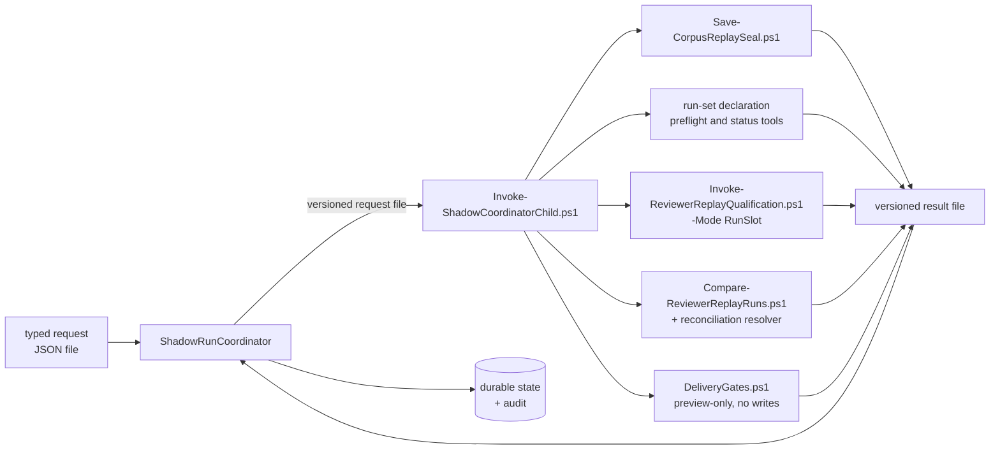

# Shadow run coordinator

`tools/ShadowRunCoordinator` is the typed control plane the escape ledger's
`typed-control-plane-pivot` decision registers. It is a dependency-free .NET 10 console
application that carries one shadow preparation from a typed request to an immutable,
signed `run-set-ready` state, and — in its third slice, and only when the request explicitly
authorizes it — supervises **exactly two** declared replay-qualification slots to verified
terminals and then has the reviewed comparison reconcile them.

> **It writes nothing outside its own output root, and it makes no reviewer decision.**
> The coordinator holds no prompt text, no model name, no candidate, no severity and no
> verdict rule; there is no model client, provider credential or HTTP type anywhere in the
> project for one to be made from. `tools/Test-ReviewerCoordinatorContract.ps1` fails the
> build if that stops being true.
>
> By default it also launches nothing: the target state is `runSetReady`, `slotLaunchCount`
> is zero, and the suite asserts it. A request that carries no `slots` section, or one that
> sets `shadowSlotsEnabled` to `false`, cannot reach a slot state at all; a request whose
> `slots.reconciliation` is absent or disabled cannot reach a reconciliation state. When a
> slot *is* authorized, the process it starts is the already-reviewed PowerShell
> qualification runner, which is what invokes models. The coordinator supervises that
> process — it does not read its findings. Model attempts reach the audit only as
> `slotModelInvocationCount`, an opaque passthrough of what the reviewed verifier read out of
> the owner's terminal artifact. The reconciliation is the same arrangement one level up: the
> comparison is `tools/Compare-ReviewerReplayRuns.ps1`, unchanged, and what returns to the
> coordinator is a status word, four digests and a census of integers it copies without
> reading.

## What it is for

The reviewer's preparation path is PowerShell, and it stays PowerShell. What moves here is
*coordination*: the ordering of steps, the durability of the state between them, the
supervision of child processes, and the refusal of anything that does not match its contract.
Those are the failure modes the escape ledger's incident list is made of, and they are the
ones a typed, compiled host is actually better at.

Judgement does not move. No prompt text, no model name, no candidate severity, no verdict
rule, and no reconciliation semantics exist in this project. When the coordinator needs one of
those, it invokes the already-reviewed PowerShell tool that owns it.

## The strangler seam



Every arrow crossing the seam is a **file**. The coordinator writes a request file, starts one
child, waits for it under a bounded timeout, and reads a result file. Standard output is
captured to a log and is never a contract surface: a child that prints a perfectly well-formed
result to stdout and writes nothing to its result path has failed.

One child at a time, always. A second child requested while one is in flight is a refusal, not
a queue — concurrency here would mean two writers on one output root, which is the thing the
lease exists to prevent. The supervised slot is the same seam with a longer wait: the same
single child, the same request and result files, watched under the plan's own deadlines instead
of a fixed step timeout.

## The state machine

```
requestValidated -> corpusStaging -> corpusPublished -> corpusValidated -> recipePlanned
    -> snapshotValidateOnly
    -> snapshotSealed -> snapshotVerified -> runSetDeclared -> runSetVerified -> runSetReady
    -> slot1Authorized -> slot1Launching -> slot1Running -> slot1TerminalObserved
    -> slot1TerminalVerified | slot1TerminalFailed | slot1TerminalTimedOut
    -> slot2Authorized -> slot2Launching -> slot2Running -> slot2TerminalObserved
    -> slot2TerminalVerified | slot2TerminalFailed | slot2TerminalTimedOut
    -> reconciliationAuthorized -> reconciliationLaunching -> reconciliationRunning
    -> reconciliationTerminalObserved -> reconciliationVerified
    -> deliveryAuthorized -> deliveryLaunching -> deliveryRunning
    -> deliveryTerminalObserved -> deliveryTerminalVerified
```

There is no other order and no way to skip. Each transition appends a record to a durable
state file under a monotonic sequence, and the file is replaced atomically. Restarting the
coordinator at any point re-reads that file, recognises the transitions already recorded, and
resumes at the next one — it does not re-run a child whose transition is already committed.

The three terminal states of each slot are siblings, not a sequence: they share one rank, and
they are the three things a finished slot can be. `--target slot1TerminalVerified` therefore
reaches any of them; the exit code, not the target, says which. Everything from
`slot1Authorized` on happens only when the request turns the slots on, so the default path
still stops at `runSetReady`.

Both slots are declared in the request from the moment the request is signed, and the
declaration is what the whole set is prepared against: the run set is planned for exactly two
runs, and there is no transition, argument or code path that adds a third or resumes a set
under a changed declaration. Ordering is enforced twice over. `slot2Authorized` requires this
coordinator's own signed `slot1TerminalVerified` record, and the reconciliation requires both
slots' — so a slot that fails or times out is a slot that closes the set, because
`slot1TerminalFailed` is not `slot1TerminalVerified` and nothing downgrades that. The reviewed
PowerShell readiness gate is asked the same question independently and must also agree.

`reconciliationRunning` is not decoration. The reviewed comparison mints its single-use
attempt record as its first act, so a coordinator killed while the comparison runs comes back
to an authorization that is already spent. Committing the child's identity *before* the wait
is what makes that recoverable: the resumed run adopts the process its own signed record names
instead of concluding that somebody else consumed the one attempt. It is the same shape as
`slot1Running`, for the same reason, and the suite kills the coordinator in exactly that window.

Each transition record carries the evidence it was committed on and a digest over that
evidence. The audit is built from those records rather than from anything the process
accumulated in memory, so an audit written after a restart is identical to one written by a
run that was never interrupted. That is the property that makes "kill it anywhere" a test
rather than a hope.

`--halt-after <state>` stops deliberately after a named transition and exits 9. It exists so
the suite can stop the process at every single transition and start it again. It is a fault-test
argument and nothing else: a cohort declared `shadow-cohort-run` may not forward it, and the
kind that may cannot start this program at all.

## Building the corpus

`corpusStaging` and `corpusPublished` exist because a corpus used to be built by a private
script, and the way that script failed is instructive. It copied a captured corpus wholesale —
including the previous run's identity witness — and then tried to overwrite the witness inside
the copy. The captured corpus was read-only, as captured evidence should be, so the overwrite
failed with access denied, and it failed *before* the coordinator had any record that a corpus
was being built at all. The visible symptom was a permission error. The actual defect was that
a corpus's identity was whatever had been inherited from whatever was copied, and nothing typed
was accountable for it.

Both are fixed the same way: the corpus is built from a declaration rather than from a
directory, and it is built in the control plane rather than beside it.

The declaration is `devpilot.shadow-run-coordinator.corpus-stage-request.v1`, named by the
request's optional `corpusStage` section and bound there by digest. It names, per payload, the
corpus-relative path, the absolute source path, the exact SHA-256, the exact byte length, the
form (`utf8Text` or `binary`) and the role. It names the identity witness's fields outright, and
it names the digest the finished index must have. Every source it names is read and never
written, so a read-only source corpus is an ordinary input rather than a failure.

The order is the contract:

1. A journal is written into the coordinator root **before** the staging directory exists, so
   there is no instant at which a staging directory exists that no journal claims.
2. The staging directory is created empty, beside the destination and therefore on its volume.
3. The **identity witness is written first**. A staging directory that exists at all already
   says which subject it is for.
4. Each remaining payload is read once from its immutable source — length checked against the
   declaration, exactly that many bytes read, end-of-file asserted — and the digest compared
   against the declaration is computed over the bytes actually read. A source rewritten between
   a hash and a read cannot pass. Each file is then re-read from disk and re-digested.
5. The index is **generated last**, from the declaration, through the same canonical rendering
   the PowerShell canonicalizer produces. PowerShell remains normative; the C# side has only to
   agree, and it refuses to publish if the index it generated does not digest to what was
   declared.
6. The staged tree is validated as a set: every declared path present, no extras, no
   duplicates, no reparse points, every length and digest re-read.
7. Publication is a single `Directory.Move` onto a path that must not exist. That is what makes
   two concurrent builders resolve to exactly one winner without a lock.
8. The published corpus is made read-only, and the result contract
   `devpilot.shadow-run-coordinator.corpus-stage-result.v1` is written.

A run killed at any point in that sequence leaves either no journal and no directory, or a
journal naming a directory that may be complete, partial or absent — and in every one of those
cases the next run can tell whether the leftovers are its own. It removes only a staging
directory its own journal claims; a journal opened by another correlation is a refusal rather
than a licence to tidy up. A published corpus is never replaced, merged into, or written over:
a destination that already holds a corpus with the digest this run staged is adopted, and one
with any other digest is refused.

Staging is optional. Without a `corpusStage` section both transitions commit
`staged: false` and touch nothing, which is the retained PowerShell default: the corpus is
built the old way and `corpusValidated` reads it exactly as before. They are two ranks rather
than one because the on-disk shape either side of the move is completely different, and a
single rank could not say which side a resumed run was on.

## The supervised slots

The slot slices add no reviewer logic. What runs a slot is
`tools/Invoke-ReviewerReplayQualification.ps1 -Mode RunSlot`, unchanged, reached through the same
one-step-one-file child contract every other transition uses. What the coordinator adds is
authorization, a durable identity for the child, and supervision.

Both slots take the same five states and the descriptions below apply to each, with `slot2`
substituted for `slot1` throughout. What differs is only the gate in front of them: `slot1` may
be authorized once the run set is ready, and `slot2` may be authorized only once this
coordinator's own signed record says `slot1TerminalVerified`. Each slot carries its own
one-shot launch-authorization token, its own nonce, its own state root, its own child step
names and its own exchange files, so no result published for one can be adopted as the other's
answer.

**`slot1Authorized`** is the only state that decides anything. The launch-authorization token
named by the request is compared against the token the run set published beside its declaration —
by digest, and the refusal names neither, so a wrong token is not an oracle. Then the reviewed
`New-ReviewerReplayQualificationPlan` rebuilds the plan under that token's hash, the reviewed
assertions bind it to the signed declaration, and the resulting plan digest, set ID, slot name and
deadlines are committed. From here on the coordinator compares against what it committed, never
against what a later child says.

The deadlines are the *plan's*, not the request's. Hard and activity budgets are the plan's slot
and progress timeouts; the per-call bound is read back out of the slot's sealed argument vector,
which the plan digest covers. The request contributes exactly one number,
`supervisionGraceSeconds` (30–3600), which is how long the supervisor waits past a plan deadline
before it stops the child itself. A plan whose per-call or activity bound exceeds its hard bound
is refused rather than clamped.

**`slot1Launching`** re-probes eligibility immediately before the irreversible step, through a
separate `slotPrelaunch` child whose previous result is deleted first. Adoption is right for work
that must not repeat and wrong for a probe, so the probe does not share the plan step's result
file. If an attempt record or terminal artifact has appeared since authorization, the single-use
launch has already been spent and the run refuses rather than starting a second one.

**`slot1Running`** is committed *before* the wait, carrying the child's process ID, its process
start time, the digest of the child request and the attempt number. This ordering is the whole
point: a coordinator killed during an hour-long slot must be able to name what it left behind.
A process whose start time cannot be read is half-identified, and half an identity is none: it
could not be told apart from whatever the operating system later gives that process ID to. Such a
child is stopped at launch and the run fails, rather than being supervised or left unowned.

**`slot1TerminalObserved`** is the wait. A resumed run adopts the child its own signed
`slot1Running` record names — matched on process ID *and* start time — instead of launching
another. Both halves must be present and equal; an unreadable start time on either side is never
a match, so an unrelated process that inherited the ID is neither waited on nor killed. The
lease's live-child refusal makes an exception for exactly that identity, derived from
the signed record rather than from the forgeable journal, and for nothing else. When a deadline
expires the child's whole process tree is stopped, output is drained with a bound, and the run
reports the kill rather than reading whatever the corpse left. Stopping a tree is best effort by
construction — a descendant that was already exiting cannot be killed again — so a partial kill
never becomes the run's error. What settles the outcome is the bounded wait and the artifact the
child did or did not write, and the journal entry is always cleared either way.

**`slot1TerminalVerified`** hands the terminal artifact back to the reviewed verifier and to the
reviewed inventory census, then checks what came back against the committed record: the artifact's
kind and version, its slot, its set ID, its plan digest, that it is read-only, that its status and
its timeout flag do not contradict each other, that exactly one attempt record exists, and that its
digest is the one this run observed. `complete` commits `slot1TerminalVerified` and exits 0;
`failed` and `timedOut` commit `slot1TerminalFailed` or `slot1TerminalTimedOut` and exit 5. Those
are outcomes, not errors: a qualification slot that fails is *supposed* to exit non-zero.

Everything inside the terminal artifact — findings, verdicts, severities, candidate text, model
names, attempt counts — is opaque. The coordinator indexes it, digests it and refuses on its
shape; it never reads it for meaning. `tools/Test-ReviewerCoordinatorContract.ps1` enforces that
mechanically: the C# sources may not mention prompts, models, severities, candidates, verdicts or
provider writes at all.

Model names are not an exception to that. A slot's request may carry an `opaqueArguments` list
and a model plan, both of which are strings inside the signed request, and both of which the
coordinator forwards verbatim to the child and never inspects. They exist so the operator can
say which reviewed configuration each slot runs; the coordinator has no branch that reads them,
and the contract suite fails if one appears.

## The reconciliation

The set closes with one comparison of its two runs, and the comparison is
`tools/Compare-ReviewerReplayRuns.ps1` followed by the reviewed reconciliation resolver —
unchanged, reached through the same child contract, and invoked *without* the switch that turns
disagreement into a non-zero exit. Reacting to disagreement is precisely the judgement this
coordinator must not make. What it requires instead is that the comparison ran, sealed its
artifact, and wrote its summary.

The exchange is two versioned files under the coordinator's own output root. The coordinator
publishes `reconciliation-request.json`
(`devpilot.shadow-run-coordinator.reconciliation-request.v1`), commits its digest, and the child
refuses to act on any other bytes. The child writes back
`reconciliation-summary.json` (`…reconciliation-summary.v1`) at the one path the request names.
Nothing passes between them on a command line or through an environment variable.

**`reconciliationAuthorized`** requires this coordinator's own signed `slot1TerminalVerified`
*and* `slot2TerminalVerified`, and independently requires the reviewed readiness gate to agree
that the set is reconcilable. It commits the set ID, the plan digest and the required run count,
which must equal the declaration's planned run count of two.

The one run each slot offers is found where the reviewer writes it — under
`<slot-state>/replay/<snapshot>/convention-specialist-previews`, beside the signing key that
opens it — and the snapshot naming that directory is the one *the plan seals*, never one read
off the disk. A slot state directory that has replayed two snapshots therefore still offers the
reconciliation exactly one candidate, and a sibling left by some other snapshot can never be it.

**`reconciliationLaunching`** publishes the input document and commits its digest.

**`reconciliationRunning`** commits the child's identity before the wait, for the reason given
in the state machine section: the comparison's attempt record is single-use and is minted before
the comparison starts, so without this record a crash in that window would leave the set
permanently unreconcilable.

**`reconciliationTerminalObserved`** reads the summary, rehashes it, checks it was written where
the request asked, and pins the two files the comparison produced — the Markdown report and the
sealed artifact — by path and digest, taken where they were made.

**`reconciliationVerified`** has the reviewed reader parse the sealed artifact and checks what
comes back against what was committed: the seal verifies under its key, the sealed
declaration is *this* run set's and plans *this* many runs, the sealed report digest matches the
report on disk, the report and artifact are the same two files this run watched being produced,
the comparison covered exactly the declared number of runs, and the artifact does not claim to
be promotable — an evaluation-only reconciliation never is. What the coordinator then records is
a status word, four digests, two run counts and an ordered census of name/value integers copied
across unread. No finding identity, no text, no severity and no verdict crosses that boundary.

## The delivery decision

The set may close with one *preview-only* delivery decision, and there is no other kind. The
decision is produced by the reviewed `src/Agents/reviewer/DeliveryGates.ps1` — unchanged,
reached through the same child contract, evaluated with every write switch off. Whether a
finding is worth surfacing, and to whom, is judgement this coordinator must not make; what it
requires instead is that the evaluation ran, sealed its decision, and reported that it wrote
nowhere.

Delivery is declared in the request at creation, next to the slots and the reconciliation, or
not at all. There is no argument, transition or code path that turns one on later, and the
declaration is refused unless it names `authorizationKind: "PreviewOnly"`, sets
`commentsEnabled`, `votesEnabled` and `gatesEnabled` to false, and sets `providerWriteBudget`
to `0`. A declaration that asks for anything else is not a delivery this build can run.

The exchange is two versioned files under the coordinator's own output root. The coordinator
publishes `delivery-request.json` (`devpilot.shadow-run-coordinator.delivery-request.v1`),
commits its digest, and the child refuses to act on any other bytes. That document is what
binds the decision to everything it was made from: the sealed snapshot, the declared run set,
the verified reconciliation and its sealed artifact, the config and policy digests, the
required head, and the correlation this run carries. The child writes back
`delivery-summary.json` (`…delivery-summary.v1`) at the one path the request names. Nothing
passes between them on a command line or through an environment variable.

**`deliveryAuthorized`** requires this coordinator's own signed `slot1TerminalVerified`,
`slot2TerminalVerified` *and* `reconciliationVerified`, and independently requires the reviewed
readiness gate to agree. It commits the set ID, the plan digest, the required run count, the
reconciliation digest the decision must close over, and the capability the plan reports. That
capability is not the adapter's own abstinence: the reviewed authority is asked with every
write switch *on*, so what comes back says what the live policy would permit if a write were
asked for, not what this run happened to ask for. Any write capability in reach — a kind other
than `PreviewOnly`, comments, votes or gates on, a promotable outcome, or a non-zero write
count — stops the run *here*, before a child is launched.

**`deliveryLaunching`** publishes the input document and commits its digest.

**`deliveryRunning`** commits the child's identity before the wait, for the same reason the
comparison does: the delivery's attempt record is single-use and is minted before the
evaluation starts.

**`deliveryTerminalObserved`** reads the summary, rehashes it, checks it was written where the
request asked, pins the sealed decision by path and digest, and refuses any reported write.

**`deliveryTerminalVerified`** has the reviewed reader parse the sealed decision and checks what
comes back against what was committed: the seal verifies under its key, the decision is *this*
run set's, it closes over *this* reconciliation, it covered exactly the declared number of runs,
it does not claim to be promotable, it still reports `PreviewOnly` with every capability off,
and both `providerWriteCount` and `writeToolInvocations` are zero. What the coordinator then
records is a status word, three digests, one run count, four flags and an ordered census of
name/value integers copied across unread. It never compares that status word to a literal, and
it has no branch on which one it got: a decision that found nothing, one that let nothing
through, one that would be eligible in preview and one built over a run the comparison called
unusable all reach the same terminal and record the same two zeroes.

## Refusals

The request is strict JSON, UTF-8 with no byte-order mark, read from a file. It is refused for
an unknown field, a missing field, a null where a value is required, a scalar where an object
or array belongs, a byte-order mark, a truncated document, an empty file, a top-level array,
and a nesting depth beyond 32. The same strictness applies to every child result.

Beyond shape, the run is refused when:

* the repository head is not the exact commit the request binds,
* a configuration, prompt-asset or schema digest does not match what the request declared,
* the corpus index digest does not match the corpus on disk,
* a corpus stage declaration disagrees with the request that carries it — a different
  correlation, toolkit head, output root, corpus root, index digest or subject identity,
* a corpus stage declaration is not internally sound: a path that is not a canonical corpus
  path, a payload declared twice or aliased by case, two payloads reading one source, payloads
  out of ascending ordinal order, an index declared as a payload, no identity witness or more
  than one, a witness whose path is not the one the identity names, or a missing mandatory role,
* a declared source does not exist, is a reparse point, is a different length, grew while it was
  being read, digests to something other than the declaration, or — where the payload is
  declared textual — opens with a byte-order mark or is not valid UTF-8,
* a corpus destination already exists when staging begins, appears between the check and the
  move, or already holds a corpus whose index digests to something other than what this run
  staged,
* a staging journal in this output root was opened by another correlation, for another request,
* the durable state file's own integrity check fails, or its correlation ID is not this run's,
* a signing key exists in the output root **and** that root holds standing work — an audit,
  exchange records, stage artifacts, a replay root or a qualification root — but the state
  record those were produced under does not. A key on its own is not that condition: a first
  attempt refused for an ordinary reason (a mistyped digest, a moved toolkit, a head that has
  since advanced) has published nothing, and the corrected second attempt against the same root
  must work. The key is therefore written from inside the save that produces the record it
  signs, so the two exist together or not at all,
* the recipe file named by the request no longer hashes to the digest `corpusValidated` recorded
  for it. A resume skips the validation that blessed the recipe, so the seal re-checks the
  content it is about to consume — in the coordinator before the child request is built, again
  in the child, and finally inside the sealer itself: `Save-CorpusReplaySeal.ps1` takes an
  optional `-RecipeSha256` and checks it over the exact bytes it parses, which is what closes
  the window rather than narrowing it, because those bytes are never read a second time. The
  child's other read of the recipe — the one that derives the deterministic snapshot id used to
  decide whether an already published snapshot can be adopted — carries the same digest, so a
  swap cannot steer adoption at a snapshot the request never bound either,
* another live process holds the lease on the output root,
* a child this output root's launch journal records as running is still alive. A coordinator
  killed from outside never runs its own cleanup, so the `pwsh` it started outlives it; the
  lease handle closes but the writer does not stop. The journal records the child's process ID
  *and* its start time at the moment it starts and clears them when it exits, so the next run
  refuses while that exact process is alive and proceeds once it is gone. The journals are read
  twice: once before the lease is taken, for an early and friendlier refusal, and once from
  inside the lease, which is the check that settles it — the first one on its own races a
  coordinator that starts a child and is killed in the window before this one acquires.

Liveness is always re-derived from the live process table and never trusted from a file, so a
journal left behind by a crash, a full disk or a machine that was rebooted cannot wedge an output
root: the recorded process is simply gone. A recorded identity that matches only by process ID
is not the child either, so a recycled ID can produce a false conflict — which is safe — but
never a false clearance.

A child result is refused, even when it is genuine, correlated and correctly digested, when it
disagrees with the record about *which subject* it is describing. A signature proves a run set
was declared under this output root's key; one key signs every declaration in a root, so a
declaration left behind by an earlier subject verifies perfectly. So the verified manifest's
snapshot must be the snapshot this preparation sealed, the status read's set must be the set the
previous transition verified, and a standing declaration is adopted only when it was sealed
under the *whole* plan this request would have declared.

That last binding is the production one, not a paraphrase. The declaring child rebuilds the
qualification plan with `New-ReviewerReplayQualificationPlan`, reproduces the launch-authorization
hash by reading the token the declaration itself minted — the plan digest binds that hash, and
`Declare` mints it at random, so the token is the only way to reproduce the plan — and then binds
the standing declaration through `Get-VerifiedRunSetDeclaration` and
`Assert-ReviewerQualificationDeclarationMatchesPlan`. The plan digest covers the reviewed
repository, the config, the operator, the commit and ref, the models, the timeouts and every slot
argument vector, so a declaration that agrees on snapshot, manifest digest and run count but was
made for a different qualification is refused. A declaration whose token is gone is not adoptable
either: without it the plan cannot be reproduced, and adopting on the strength of the fields that
remain is exactly the substitution this check exists to refuse. Verification failure and plan
mismatch share one refusal, because adoption is a positive proof and anything that stops the
proof means the set is not this preparation's.

The lease records the holder's process ID *and* its process start time, and liveness is decided
by looking up that exact identity. A recycled process ID with a different start time is not the
holder. Nothing reads a command line to decide whether a process is alive. A lease whose holder
cannot be alive is treated as abandoned rather than as a permanent conflict, so a crash cannot
wedge an output root for ever.

A supervised slot is refused when:

* the request turns the slot on but names no launch-authorization token, or names one that is
  not the token the published run set carries,
* the qualification plan the reviewed builder produces under that token does not bind to the
  signed declaration,
* an attempt record or terminal artifact already exists at authorization or reappears between
  authorization and launch — the launch is single-use, and a second one is not a wasted run but
  an unrecoverable one,
* the plan's own deadlines are inconsistent: a hard bound of zero, or a per-call or activity
  bound larger than the hard bound,
* the child was stopped by this coordinator on a plan deadline. The run reports the kill; it does
  not summarise a run it ended itself,
* the child exited leaving no result, or a result that is absent, malformed, wrongly correlated
  or wrongly digested,
* the terminal artifact is missing, writable, of the wrong kind or version, for another slot,
  for another run set, sealed under another plan digest, self-contradictory about its timeout, or
  accompanied by anything other than exactly one attempt record,
* the terminal artifact's digest is not the one this run observed before it committed
  `slot1TerminalObserved`. The artifact is written read-only by its owner, so a changed digest is
  a tamper rather than a race.

`slot2` adds one refusal to that list: it is refused unless this coordinator's own signed record
already says `slot1TerminalVerified`. `slot1TerminalFailed` and `slot1TerminalTimedOut` are not
that, so a slot that fails or times out closes the set — and the set stays closed, because
nothing in this build re-authorizes a spent slot or resumes a set under a changed declaration.

A reconciliation is refused when:

* either declared slot is not verified complete in this coordinator's own signed record, or the
  reviewed readiness gate does not independently agree the set is reconcilable,
* the reviewed plan is for another run set, digests differently than the digest the
  authorization was committed against, or plans a different number of runs than the declaration,
* a comparison attempt record already exists at authorization or appears between authorization
  and launch — the comparison, like a slot launch, is single-use,
* the child was stopped by this coordinator on a plan deadline, or exited leaving no result, or
  a result that is absent, malformed, wrongly correlated or wrongly digested,
* the comparison wrote no summary, wrote it somewhere other than the one path the request named,
  or wrote one whose bytes do not digest to what the child reported,
* the sealed artifact does not verify under its key, declares another kind, carries no
  declaration, is for another run set, plans a different run count, or binds a report digest that
  is not the report on disk,
* the report or the artifact offered to the verification step is not the same file, with the same
  bytes, that this run watched the comparison produce,
* the comparison covered a different number of runs than the set requires, or the artifact claims
  to be promotable,
* the opaque census is empty, names anything twice, or names anything that is not a plain
  alphanumeric identifier.

Exit codes: `0` ok, `1` usage, `2` request contract, `3` lease conflict, `4` child failure,
`5` a slot that finished failed or timed out, `9` deliberate halt.

## Stage artifacts

`src/Agents/reviewer/ShadowPreparation.ps1` is the shipping entry point that turns on the stage
file contract and publishes all twelve stage artifacts. The coordinator rereads every one of
them through the strict reader and indexes them by kind, byte length and digest; its audit does
not close unless all twelve distinct kinds are present and every one was reread.

This is what moved the file contract from "built and CI-verified" to "in force" in
`docs/escape-ledger.v2.json`: not a document saying so, but a compiled consumer that cannot
reach its terminal state without the files.

## The cohort

Everything above prepares one pull request. The cohort is the operator-initiated layer that runs
that same preparation across several of them, one after another, and it deliberately adds nothing
to what a preparation does — it adds only the accounting that makes running many of them
answerable afterwards.

It is a separate mode of the same executable:

```
ShadowRunCoordinator --cohort <manifest.json> --authorized-by <alias>
ShadowRunCoordinator --cohort <manifest.json> --authorized-by <alias> --rebuild-index
```

The alias is an argument, not a manifest field, and that is the point. A cohort whose
authorization could be read out of a file would be a cohort a scheduled task could start by
writing that file. There is no unattended path to this mode.

**One manifest, sealed before anything runs.** `devpilot.shadow-cohort.manifest.v3` declares the
cohort id and correlation, the exact toolkit checkout and required ref, the global ceilings, and
an ordered list of entries. Each entry pins one already-written typed request by path *and*
digest, restates that request's subject and its three configuration digests, declares where the
reviewer rules it will be run under came from, names its own immutable output root, and carries a
sealed plan estimate. The manifest is read as strict UTF-8 without a byte-order mark, through the
same strict reader everything else uses; an unknown field, a missing one, a repeated pull request,
two entries sharing an output root, an ordinal that disagrees with its position, or a set of
estimates that cannot fit the cohort's own ceiling is a refusal before any process starts. Nothing
is read from stdin and nothing contractual is written to stdout.

**Concurrency is one, as a constant.** `SupportedConcurrency` is a literal in the contract and a
manifest declaring anything else is refused. Two preparations sharing one toolkit checkout is a
different experiment from the one this build has evidence for, so it is not offered.

**Every entry is the whole pipeline.** Before an entry is launched the runner re-reads its request
and checks that the bytes still digest to what the manifest sealed, that the subject still matches
field for field, that the toolkit head and required ref are the cohort's, that the rule bundle
declaration still digests to what was declared, that the output root is the one that was declared,
and that the request declares both slots, the reconciliation and a `PreviewOnly` delivery with a
zero write budget. An entry that declares less than the full pipeline is refused rather than run
in a reduced shape.

**And every entry is reviewed under a configuration bound to the branch it is pinned to.** The
entry's subject pins `targetRefName`, and immediately before the child is launched the runner reads
the reviewer configuration that entry's request names — through the digest the manifest already
sealed for it — and requires `review.targetRefName` to equal the pinned one, exactly. A pull
request that merges into a release branch reviewed under a configuration bound to the trunk is not
a review of that pull request, and the mismatch does not announce itself: the preparation gets as
far as fetching and reconciling before anything notices, by which point models have run. A missing
pin, a missing or unreadable configuration, a configuration whose bytes no longer match its sealed
digest, or a ref that differs in any way including case blocks the entry before its preparation
starts, and abandons the cohort rather than the entry.

Be precise about what that proves and what it does not. It proves that the manifest and the
reviewer configuration agree; it does **not** prove that either agrees with the branch the pull
request currently merges into, and it cannot, because the runner performs no provider I/O of its
own and the typed request carries commits rather than ref names. The manifest signer is
authoritative for the pinned ref. Live drift — a pull request retargeted after the manifest was
sealed — is caught one layer down, and specifically by the reviewer's own candidate predicate
(`Get-ReviewerCandidateDecision`), which compares the live pull request's `targetRefName` with
`config.review.targetRefName` and declines the pull request before any model process starts; every
pull request goes through that predicate, including one named explicitly by `-PullRequestId`. It is
*not* the pre/post identity capture that catches a retarget: that binds commits, status and
repository, and detects movement *during* the capture rather than a stable mismatch before it. So
the pin is what stops a stale or wrong configuration from being used; the predicate is what stops a
retargeted pull request from being reviewed. The pin is deliberately *not* part of the subject
digest: the typed request has no such field, so digesting it would make every entry's subject
compare unequal to the request it pins.

**A production cohort cannot pass a fault argument.** `execution.argumentPrefix` is forwarded to
the child verbatim, and every token in it is classified when the manifest is read: fault injection
and test-only switches (`--halt-after`, `--crash-after`, `--simulate`, `--stub`, `--test-only` and
their neighbours), the arguments this runner appends itself (`--request`, `--target`, `--cohort`,
`--authorized-by`, `--rebuild-index`), script-host switches (`-File`, `-Command`, `-EncodedCommand`)
and script paths. Tokens are compared whole and case-insensitively, and `--option=value` is split
at the first `=` so an option cannot hide inside a value; nothing is matched by substring, so an
output root that happens to contain the word "fault" is not a refusal.

A cohort declared `shadow-cohort-run` that forwards any of them is blocked *before* the launch,
not at load — a frozen root written under a halt argument has to stay readable so `--rebuild-index`
can re-derive its evidence, and refusing to parse it would make that evidence unreachable rather
than unusable. Filtering the arguments would achieve little on its own, since a cohort free to name
any executable could hand the refused switches straight back to whatever it started — `cmd /c
"dotnet …\ShadowRunCoordinator.dll --halt-after …"` passes every argument test there is, because
the splitting that reintroduces the switch happens one process later. So the admissible production
launches are *enumerated* rather than filtered, and there are exactly two: the command is
`ShadowRunCoordinator.dll` or `ShadowRunCoordinator.exe` by whole file name, or the command is
`dotnet`/`dotnet.exe` by whole file name and the **first** argument names that assembly. In both,
the next thing to read an argument is this program's own parser, which takes whole tokens and knows
no `--option=value` form. A shell, a wrapper, a script, or this program named anywhere other than
first is refused without being asked what its arguments were.

Two smaller refusals hold that enumeration up. No launch token — command or argument — may contain
a C0 control character or DEL; this is a load-time well-formedness refusal, because
`Path.GetFileName` scans back from the end of a string while process creation stops at the first
`U+0000`, so a token containing one would name this program to every check here and start something
else. And the `dotnet` arm compares whole file names rather than the name without its extension, so
`dotnet.com` and `dotnet.cmd` are not the host. What all of this still leaves outside the check is
an operator who renamed a binary on their own disk, which is not a boundary a manifest reader can
hold — the same operator can edit the manifest.

A fault test that genuinely needs those arguments declares `kind: "shadow-cohort-test-run"` instead,
and pays for the permission with the mirror image: neither the command nor its arguments may name
`ShadowRunCoordinator`, and they must name a script. The claim is exactly that and no more — the
declared launch does not directly name the preparation. A stub script is free to start whatever
*it* likes, including the preparation, so the kind is a development affordance rather than a proof
of model isolation, and it is not an operator contract. An operator cohort is always
`shadow-cohort-run`.

**A non-zero exit is not the last word on whether an entry finished.** A preparation told to stop
at the cohort's declared target and stopping exactly there writes its evidence, writes its ending,
and exits 9 to say it stopped on purpose. Reading the exit code alone calls that a fault and
abandons every entry behind it, while every artifact needed to see that it was finished sits on
disk, signed. So an entry that ended non-zero is adopted as complete when, and only when, its own
authenticated audit proves it: the exit is 9 and no other non-zero code; the state it reports at
rest is the cohort's declared target, so a run halted *earlier* is never adopted; it is at rest for
`completed` or `deliberateHalt`, which are the two reasons a walk chooses; every transition and
artifact digest the declared target's rank implies is published — a delivery target requires the
delivery digests, an earlier target requires only what that rank cannot have been reached without,
each threshold being the rank of the transition that publishes that digest, except that the
snapshot digest is required at every rank, so adoption is deliberately *unsupported* below
`snapshotVerified` rather than thinned out to nothing; the signed state record still standing in
the output root is the one the audit was written over; and nothing was written to the provider. The
audit's correlation, request digest and subject digest were already required to be the manifest's
by the reader that produced the summary. An adopted entry is counted in `completedEntryCount` and
named by ordinal in `adoptedCompleteEntryOrdinals`; its per-entry summary is left byte-for-byte as
it was committed, because that summary is digest-bound to the journal and an index that rewrote it
could no longer be checked against the record it claims to be derived from. A rebuild re-derives
that proof rather than inheriting it: a journal recording an adoption whose artifacts no longer
support it blocks the index rather than repeating the word it was given.

**Sequential, journalled, and never retried.** The cohort journal
(`devpilot.shadow-cohort.journal.v3`) is signed and replaced atomically, and it moves an entry
through `pending → launchIntended → running → ended`. The launch intent — including the entry's
digests and the exact command — is committed *before* the process exists, and the child's process
id and its exact start time are committed as soon as it does, which is what makes "did this entry
already start?" answerable after a machine dies rather than inferred. An entry that reached
`ended` is finished: the journal refuses to reopen it, so a resume can never produce a second
preparation over a subject whose first preparation already published evidence. There is no retry,
no requeue, and no replacement — a cohort that needs a different set is a different cohort, with
its own manifest and its own operator.

A resume that finds an entry still `running` checks whether the recorded child is genuinely alive,
by process id *and* start time. If it is, the resume refuses (exit 6) rather than running beside
it; once that child is gone the entry is relaunched from a clean attempt, and the entries before
it are not touched. A `running` record that carries neither a usable process id nor a start time
cannot answer that question at all, so it refuses too: answering "not alive" by default is exactly
how a second preparation gets started over a live output root.

**The ceiling is checked before the entry that would cross it.** Admission uses what the cohort
has actually spent, taken from the ended entries' own audits, plus the sealed estimate of the
entry about to start. If that would cross the declared maximum model starts, verifier assignments
or wall clock, the cohort stops (exit 10), the remaining entries stay `pending`, and the index says
so. A ceiling checked afterwards is a ceiling that has already been exceeded.

**And the estimates are proved before the first entry.** A `planEstimate` is an operator's
number, and a cohort that budgets against a number nobody derived can authorize a run that
starts more models than it declared. Each entry therefore carries a sealed
`modelStartBound` — path and digest — produced by `tools/New-ShadowModelStartBound.ps1`, which
lives on the reviewed side because what an argument vector means is the reviewed side's
business. It re-hashes the reviewer configuration the request pins, rebuilds the slot arguments
with the reviewed builder, and multiplies the toolkit's own per-attempt limits: for each declared
slot, the configured generalist passes times the generalist retry limit, plus the specialist
retry limit when verification is authorized, plus the capped maximum verifier launches times
their per-run attempt limit. Reconciliation and delivery contribute none. The same artifact —
`devpilot.shadow-cohort.model-start-bound.v2` — also publishes the per-slot maximum verifier
*assignments*, which is a different unit and is summed into its own bound.

Before anything launches, the runner checks that each bound file digests to what the manifest
sealed, that it was taken over *this* entry's request bytes and this cohort's toolkit head, that
the entry's declared `modelStarts` is not below the bound it publishes, that its declared
`verifierAssignments` is not below the assignment bound the same artifact publishes, and that the
sum of each kind of bound fits its global ceiling. A missing, unreadable or mismatched bound is a
refusal, and the bound is never re-derived here.

Both superseded manifest contracts are refused **by name**, each with the reason its budget was
unsafe, rather than being reported as an unrecognised version.
`devpilot.shadow-cohort.manifest.v1` measured its model-start budget in reviewer processes.
`devpilot.shadow-cohort.manifest.v2` measured its verifier budget in committed verifier-backed
terminal transitions — a list with eight members — so a run standing on forty reciprocal
assignments was scored as four, and no run could ever cross the ceiling. Re-reading either under
this build would silently reinterpret an operator's authorized number, in one case by a factor of
ten.

**The verifier ceiling is spent in assignments, not in the states a run reached.** An assignment
is the verification contract's own identity: one candidate paired with one required reciprocal
verifier model, minted as an `assignmentId` over the cluster, the candidate hash and the target
model, with exactly one assignment per candidate per required model. The bound is therefore the
plan's own cap — the reviewed side refuses a plan whose required assignments exceed the effective
verifier ceiling, so that ceiling *is* the per-run assignment cap — summed across the declared
slots. The actual is read from each entry's signed audit, which takes it from the run's own sealed
verification previews and binds the total together with a per-slot and per-verifier-model
breakdown.

Grouped verifier **process** starts are counted too, under their own name, and no budget is ever
checked against them: within one pass a launch can serve a whole cluster, so a pass's launches are
at most its assignment rows and routinely far below, while across passes the identities dedupe and
fresh nonces do not. The two are cross-checked but never required to be ordered, because grouping
and repeated verification move them independently; what is refused is a contradiction, such as a
slot reporting verifier model starts while claiming no assignment existed.

**An entry that spent more than the cohort was allowed ends it.** The estimates admit an entry;
the actuals, read from each ended entry's signed audit, are what stop the set. When the real
model starts already spent — plus the bounded allowance for slots that ended without a complete
census — exceed the ceiling, the cohort ends at `budgetExceeded`, the entry's own result stands
and is never re-run, and no further entry launches. The verifier assignment ceiling is enforced on
exactly the same terms and in its own unit.

**An entry that left no evidence stops the cohort.** A child can die, hang or be killed part-way
through a preparation, having already started models, without ever publishing an audit. Nothing it
left behind says what it consumed or whether anything acted on its behalf, so neither the ceiling
nor the zero-write claim can be computed over it. Carrying it into the index would publish a zero
write count for an entry that never proved one. Every launched entry with no readable audit
therefore blocks the whole cohort (exit 11) whatever the stop policy says, the entries after it stay
`pending`, and running the cohort again refuses again — running it a second time settles nothing
about that output root. `continueOnTerminalFailure` carries on past an entry that failed *and*
published its audit, which is a failure the cohort can account for.

This is a narrow window in practice: the preparation writes its audit before it does any work and
rewrites it on every fault, including its own contract refusals, so an entry that reached the
preparation at all leaves one. What does not leave one is a child killed or crashed before that
first write, and a refusal that happens before the preparation starts — a lease conflict on the
entry's output root is the realistic case. Blocking there is deliberate: a lease conflict means
something else is holding that root, and this runner is not the thing that should decide what.

A journal that holds an ended entry with no audit digest and any outcome other than the refusal
itself is refused on sight, by both the reader and the writer. This build never commits such a
record, so a journal containing one was written by something else, and resuming it would walk past
a preparation on counters nothing published.

**Stop policy, and what it does not mean.** `failFast` stops at the first entry that ends other
than complete; `continueOnTerminalFailure` carries on to the next one. Neither re-attempts
anything. Three conditions ignore the policy entirely and stop the whole cohort: an entry that
published no audit at all, an entry audit this build cannot read, and any reported provider write or
write tool invocation (exit 11). An audit
standing in an entry's output root counts as that entry's audit only if it names the correlation
the entry's own sealed request declares, restates the request and subject digests the manifest
sealed, and carries that entry's own signature over itself — the cohort verifies the audit's HMAC
against the state key the preparation left in its output root, in constant time, and then its
self-hash, before it believes a single counter inside it. Binding by the words alone would only
prove the file describes the right entry; anyone who could write those words could write zero into
the write counters beside them. The two write counters are then read strictly — absent, negative or
non-integral is a refusal, never the zero the cohort is trying to prove. A write observed anywhere
in a cohort invalidates the claim the whole cohort was run under, so it is not something the cohort
continues past, and the count that was observed is carried into the entry's ending and into the
index rather than being republished as zero once the entry is summarized as not-run. An entry whose
evidence was refused is *closed* with the outcome `evidenceRefused` before the refusal travels — an
entry left recorded as `running` once its child is gone would be read as resumable by the next run
— and a cohort holding such an entry stays refused on every later run until an operator settles
those artifacts by hand.

**One key format.** A signing key is 32 raw bytes: that is what the preparation mints, what it
writes into `<output-root>/coordinator/state.key`, and what the cohort journal writes beside its own
record. One reader accepts it, and the cohort authenticates an entry's audit with the same bytes,
read the same way, that the preparation signed it with. Key material is not text — most 32-byte keys
hold no valid sequence in any encoding — so a reader that decoded it would fail on the key rather
than on the artifact it was asked to check, and would fail as a decoder fault rather than as a
refusal an operator can act on. Every way of failing to acquire a key (absent, short, long, locked,
unreadable) comes out as a refusal naming the absolute path, never as a crash. Cohort journal roots
written before this rule hold a 64-character lower-case hexadecimal key; that one encoding is still
read, named rather than sniffed and only for the journal key, so a root created by an earlier build
still resumes. Nothing writes it any more.

**One acquisition per artifact.** Every contract file a cohort obeys is read once, through one
guarded reader, and the digest published for it is taken from the same bytes that were parsed. A
file read twice — once to hash, once to obey — attests to bytes nobody read, and an artifact this
runner cannot open is a fact about the artifact: it comes out as a refusal naming the file and
blocks the cohort, never as a filesystem fault from underneath. The distinction matters because a
failure to *write* the index is treated leniently — the journal is authoritative and the next run
rewrites the report — and a failure to *read* an audit must never be mistaken for one.

**The index says what ran, never what was concluded.** `devpilot.shadow-cohort.index.v3` carries
one summary per declared entry, in declared order: the preparation's final state and terminal
reason, the snapshot, run-set, reconciliation and delivery evidence digests, the model start, slot,
supervised slot, verifier assignment and provider write counts, the wall time, and the entry's
subject *digest*. It carries no organization, repository, pull request id, finding text, severity
or verdict, and it is self-hashed and signed. A refusal's own words can name an output root, and an
output root can encode the subject it was taken over, so the index publishes a closed phrase plus
`terminalDetailSha256` and the words themselves go to the operator's log.

The word the cohort publishes about itself is committed into the signed journal *before* the index
is written, so the two can never disagree and a kill between them leaves a record the next rebuild
reproduces exactly. That commit is not covered by the leniency that lets a failed index write pass:
the index is a report and can be rewritten from the journal, but a cohort that could not write down
what it published has not published it, and letting that failure pass would mean exiting
successfully while the record still said something else.

`--rebuild-index` reconstructs it from the journal and the per-entry audits alone, launching
nothing, which is what makes the index evidence rather than a log the runner happened to keep. The
rebuild is checked, not merely repeated: each ended entry's recomputed audit and summary digests
must equal the ones its ending committed, so an audit that was removed, replaced or edited after
the fact is refused (exit 11) instead of being quietly re-signed as an entry that never ran. The
rebuild reads its terminal reason out of the journal rather than inferring one, so re-publishing a
ceiling stop or a `failFast` stop cannot launder it into a completed cohort, and a rebuild pointed
at a root holding no journal or no key is refused (exit 2) rather than minting a key nobody holds
and signing an index no later run could verify. A rebuild reports a record; it does not stand in
for one.

Because a resume has to find the same record, the journal root and the index path are declared as
fully qualified absolute paths — rooted is not enough, since a drive-relative path is rooted and
still resolves against the current directory. Every entry path is held to the same rule for a
sharper reason: the child preparation is started with its working directory set to the toolkit
checkout, so a relative output root would be checked by the parent against one directory and
written by the child into another, and the parent would find nothing where the evidence belongs.
The index may not be declared over the journal, the journal key, the lease, the intent or log
roots, the manifest itself, any entry's request, any declared rule bundle, or anywhere inside an
entry's output root: the index is rewritten on every publish, including before the entries are
verified, so declaring it over the record it is derived from would destroy that record before
anyone read either.

**A completion is a claim, and a claim needs an account.** A preparation that exits cleanly has
published its audit; that is what exiting cleanly means here. An entry that reports completion with
nothing standing where its evidence belongs is refused (exit 11) rather than summarized as a
preparation that ran and consumed nothing — a completed entry with no evidence, no model starts and
no write counters is indistinguishable in the index from a cohort that genuinely cost nothing, and
it cannot support the zero-write claim the whole cohort is run under. A preparation that faulted
before it could write anything is a different case and keeps its absence, because nothing is being
claimed on its behalf.

Rolling the cohort back is not running it. The single-request mode is unchanged, the PowerShell
preparation path is unchanged, and a cohort of one entry is a preparation with a journal around it.

**Running one.** `samples/shadow-cohort.sample.json` is a complete two-entry manifest in the exact
shape this build parses, with every path, digest and identity field zeroed. An operator fills it in
from artifacts they already have — the same per-pull-request request documents the single-run mode
takes, the rule bundle declarations those requests were built against, and the digests of both —
and then runs:

```
ShadowRunCoordinator --cohort <manifest> --authorized-by <alias>
```

The alias is a command-line argument on purpose. It is never read from the manifest, so a cohort
cannot be started by a scheduled task that writes a file: somebody has to type it. Exit 0 means
every entry ended complete; 5 means the cohort was walked but an entry ended other than complete;
10 means a ceiling stopped it with entries still pending; 11 means it was blocked and needs an
operator; 6 means a committed launch could not be resolved and needs one too. Re-running the same
command resumes; it never retries.

## The subject account

A cohort spends a pull request. The evidence it produces is a *sample* of what this toolkit does on
real work, and a sample is only worth something if it is taken over a subject nobody has taken it
over before. Which pull requests have been used therefore has to be a fact on disk, not a sentence
in somebody's notes — a list maintained by hand is a list that drifts, and a drifted list is how the
same pull request gets counted twice.

The account is a signed file that lives **outside the repository**, because it records what has been
spent across branches, heads and worktrees, and a file inside a branch would say different things
depending on which branch was checked out. It holds one row per run — a *sample* — and each row
carries the subject it was taken over, the run root and manifest that produced it, the contract
version the cohort was declared under, who authorized it, the terminal it reached, the real model
starts and real verifier assignments it actually spent, the provider writes it made, and its own
digest. The file digests itself and is signed with an HMAC key written beside it.

**One subject, one counting sample.** The threshold is counted in *distinct pull requests*, so at
most one sample per `repositoryId + pullRequestId` may carry `countsTowardThreshold`. A repeat over
the same pull request — even at a new source commit — is kept as history and cannot count: a second
look at work this toolkit has already seen is not a second independent observation. The subject key
is a digest of the case-folded repository identity and the pull request number, so retyping the
repository in another case cannot spend the same subject twice, and the same number in two
repositories is two subjects.

**What a manifest binds.** A v3 manifest may carry a `registry` section naming the account file, the
revision it was authorized against, the subject it intends to occupy, and a mode:

```json
"registry": {
  "path": "D:/shadow/registry/gate5-cohort-registry.json",
  "sha256": "none",
  "targetSubjectKey": "6d36015b4d63f04d37b220299afaa98a327b8da41a0f479eb86c899df97889ce",
  "mode": "count"
}
```

`sha256` is the revision digest the operator authorized against, or `none` when this cohort is
starting the account. `targetSubjectKey` is recomputed from a declared entry's own pins rather than
typed beside one, so a binding that names a subject no entry runs is refused. `mode` is `count` —
the cohort occupies its subject and refuses one already held — or `diagnostic`, which may repeat a
subject on purpose and can never produce a counting sample. A `diagnostic` cohort may only name a
subject the account **already holds**: a diagnostic row is deliberately invisible to the settle pass so
that repeating a subject does not evict the row it repeats, and if such a row were the only thing
holding a fresh pull request the models would have seen it while a later cohort stayed free to count it
as a first, independent observation. A first look has to be the counting one.

The section is **optional in shape and required in effect**. It is optional to *read*, because every
manifest written before the account existed binds nothing and those roots still have to be
rebuildable. It is required to *launch*: a cohort that names the shipping preparation and binds no
registry is refused with exit 11 before any child exists.

**Refusal comes before the child.** The registry is verified and every declared entry's subject is
checked in the pre-walk, beside the toolkit-head and sealed-bound checks — a two-entry cohort whose
*second* subject is already held refuses both rather than spending the first. The revision on disk
must equal either the revision the manifest bound or the revision this cohort itself last produced;
anything else means the account moved under the authorization and is refused. One further revision is
accepted: the account's `previousRegistrySha256` names the revision it replaced, so a file that says it
succeeded exactly the revision this cohort last committed is a write that landed while the journal
entry recording it did not. One step, never two — an account further ahead than a single interrupted
write moved for reasons this cohort cannot account for. Nothing is lost by accepting a successor that
another cohort wrote: its rows arrive with the file, and if one of them holds a subject *this* manifest
declares, the held-subject refusal still stops the run.

**Two runs, one account.** Nothing outside the account serializes two cohorts writing to it, and two
runners that both read revision 5 and both composed a 6 would each publish a file holding their own row
and not the other's — freeing the subject the loser recorded. So every write takes a `.lock` gate beside
the file for the whole read-modify-write and, inside it, re-reads the bytes on disk and refuses if their
`registrySha256` is no longer the one this run loaded. The gate narrows the window; the re-read closes
it, because it does not depend on the gate being honoured. Inside that same gate the key on disk wins:
two runs that both open an account nobody has started yet each mint a key of their own, and if one
persists its key and then stops, the other would otherwise sign the first revision with a key no reader
will ever load — a file that authenticates against nothing and can only be rebuilt over, never opened.
The key is read through the same strict reader a load uses, and it is flushed to the device before the
revision it signs is published.

**Recording comes before refusing.** The revision-binding refusal above is raised by the very event
that can strand a row: another cohort writing to the shared account between this one's ending and its
sample. So before that refusal is thrown, every entry the journal already shows as *ended* whose row is
missing is re-derived from the same signed evidence a rebuild would read and written to the account —
and the journal is deliberately **not** moved to the new revision, because recording what was spent must
not double as adopting a registry this cohort was never authorized against. The refusal still stops the
run, and it names what it recovered.

**Budgets are compared cumulatively.** A sample counts only if what the cohort had spent *before* this
entry, plus what this entry spent, is inside the manifest's global ceilings — the same total the runner
itself refuses to cross. Comparing one entry against a whole-cohort ceiling would let a three-entry
cohort record three counting rows that together spent more than it was ever authorized for.

**Recording comes after the ending.** Once an entry's ending is committed, its sample is composed
from the authenticated audit and appended atomically, and the new revision digest is committed to
the journal. A runner killed between the two leaves a closed entry with no sample; the resume
re-derives the same sample from the same evidence, and because the sample key is derived from the
audit digest it lands on the same bytes rather than adding a row. Every finished entry leaves a
sample — failed, refused, over-budget and unauthorized runs are recorded as history that does not
count, because an account that only remembered its successes could not answer the question it exists
for.

That resume records the alias the entry actually **launched** under, read from the launch intent the
signed journal pins by digest — not the alias on the resuming process's command line. A cohort started
by one operator and resumed with a different `--authorized-by` would otherwise record an authorization
that operator never gave, and a rebuild, which reads the intent, would silently correct it: two signed
accounts over one root disagreeing about who spent the subject. The same reading is used for the
holding rows an unreadable ending leaves, so no path records the resuming operator's name against
somebody else's launch. If that intent is missing or no longer
digests to what the journal committed, the entry's subject is held by a row that counts toward nothing
and the cohort stops — the subject goes on record *before* the refusal, never after it.

The same ordering covers the way in. Publishing the running index re-reads every ended entry's evidence,
so a resume that finds one of those artifacts damaged stops before the walk and before the account has
been opened at all; every already-ended entry missing from the account is put on record first, best
effort and without adopting anything, and only then does the refusal stop the run.

A sample counts only when all of it holds: the mode is `count`; the subject is not already held; the
manifest contract is v3; an operator alias and `PreviewOnly` authorization are recorded; the entry
reached the cohort's target and ended complete; the model-start and verifier-assignment censuses are
complete with no unmeasured allowance; the actual counts and wall clock are inside the declared
ceilings; and the provider write and write-tool counters are zero. The first clause that fails is
the classification the row carries, so a row never blames one of several reasons.

The order of the first two clauses is deliberate. The mode is asked first, so a diagnostic run that
wrote is filed under the mode rather than under the write. Every non-counting classification except
the diagnostic ones is an *observation*, and observations hold their subject; filing a diagnostic run
under its write would start holding subjects, and the non-counting mode would quietly begin spending
pull requests — the one thing it exists not to do. The write itself is not hidden: the row carries
the counters, the digest covers them, and a live cohort is refused at the write gate long before any
of this is reached. Past the mode, the write clause is asked ahead of everything else, because every
remaining clause is a reason a run did not qualify while that one is a reason the run was not the run
it was authorized to be.

**A run that did not qualify still looked.** A subject is claimed by the first row that qualified for
it — and then demoted again if some *other* run already put that pull request in front of the models.
A run that completed under a refused contract, or ended over its ceiling, did not qualify; it did
observe, and a second look at work this toolkit has already seen is not a second independent
observation. Runs that observed nothing claim nothing, and a run the operator declared as a repeat —
diagnostic mode, or a row already demoted for repeating — does not evict the row it repeats.

**Own is settled by the manifest digest, not the cohort id.** The pre-walk has to let a cohort past
its own recorded sample, or every resume would refuse the work it had already done. But `cohortId` is
a string an operator types, and a manifest copied from a finished one keeps it: that copy would read
the subject it is about to spend a second time as its own earlier attempt. The journal already
refuses a manifest edited between runs, so a genuine resume presents byte-identical bytes and the
same digest, while a copy — new journal root, new output root, re-pointed revision — cannot.

The account is also re-read from disk in the last moment before each child starts. The pre-walk
settles admission for the whole cohort at once, which is what lets a two-entry cohort refuse both
rather than spend the first; nothing outside the account serializes two cohorts, so a second one
launched in between would spend the same pull request for real. The re-read does not close that
window — nothing local does, short of reserving a subject before any evidence exists to record it —
but it narrows it from the length of a cohort to the length of a launch.

**An account with an open question cannot admit a counting cohort.** If the bound account records any
root it could not read, a `count` cohort is refused before any child, exit 11, naming the roots. A run
that was spent and cannot be read may have spent *this* cohort's subject, so the exclusion the pre-walk
performs is known to be incomplete, and admitting on it would produce a refusal that looks authoritative
and is not. The remedy is named in the refusal: repair or restore those roots and rebuild the account
naming every root, or declare the cohort `diagnostic`, where nothing counts and nothing has to be
provable. Diagnostic cohorts pass the gate unchanged.

**Rebuilding it.** The account can be re-derived from the immutable run roots:

```
ShadowRunCoordinator --rebuild-registry --registry <path> --from-cohort <manifest> [...] \
                     --authorized-by <alias>
```

It reads the same artifacts a run reads — the sealed manifest, the signed journal beside it, each
entry's authenticated preparation audit, and the launch intent the journal pins by digest for the
authorization — and takes nothing from a published index or summary. Roots it cannot read are
recorded as defects in the rebuilt file rather than dropped, because an account that quietly
forgot a root would report a smaller reach than the toolkit really has. Roots declared under the v1
or v2 contracts are recorded as history that cannot count: those contracts declared their budgets in
the units that undercounted, so a run under them cannot occupy a subject however clean it looks.

A defect carries a **kind**, because two very different facts would otherwise be filed under one word.
`unreadable` means nobody could read the root: what it ran is unknown, and every conclusion drawn
around it is provisional. `noted` means the root was read in full and merely does not qualify — a v2
contract, a root named twice — and it leaves no question open at all. Anything that reads defects has
to know which it is holding: refusing to choose a next subject is right in the face of an unread root
and wrong in the face of a v2 root whose subjects are already on the rows, and a reader that could not
tell them apart would either stop forever or never stop.

One run read twice is one sample. A caller who names a root and a mirror of it — a pre-resume
backup, a copied directory — has named one run, and the sample key says so: it is derived from the
cohort, the entry and the audit digest, all of which a copy preserves. Those rows collapse, and the
collapse is only silent when the two agree about what happened; two rows sharing a key and
disagreeing about their contents are recorded as a defect, and **neither** of them counts. One key
naming two different runs means at least one of the two roots is not what it claims, and letting the
one that happened to be named first occupy the subject would let argv order decide what the account
asserts. The subject stays held, by a row that says plainly that what happened to it is not known.

An entry that ended and whose evidence will not read is not the same as an entry that never ran. The
first spent its subject; only its result is missing. The rebuild records it as an `evidenceUnreadable`
row — holding the subject, counting toward nothing, its census and budget compliance both false — and
files a `noted` defect beside it. Falling back to *no row* would free a pull request that had provably
already been used, which is the one mistake this account exists to prevent. The same happens inside a
live cohort when an entry is refused for evidence: the row is written **before** the refusal is
re-thrown, and a failure to write it is logged rather than allowed to mask the refusal itself.

The two defect kinds do not grade how bad a root is. They say whether the account is left with an open
**question**. When the journal names the exact subject an entry spent and a row holds it, coverage is
settled: what is missing is detail about one run, not the possibility of an unaccounted spend, and the
defect is `noted`. `unreadable` is reserved for roots that could not be read far enough to say *which*
subjects they touched — a manifest that will not parse, an entry that declares no readable identity —
because only those leave open the chance that a candidate on some future list was already used. It
matters because an `unreadable` defect fails every counting cohort and every selection closed, and a
root that cannot hand out a pull request twice should not be able to do that.

A refused ending is the same story from the other end. It commits no audit digest — there was no audit
this build would read — so holding its artifacts to a committed digest fails every time, on evidence
that is immutable and correct. Filed as an open question it would stop every counting cohort bound to
the account, for good, with no repair possible. It is instead recorded as what it is: a closed fact.
The entry ran, its evidence was refused, its subject is held, and nothing about that is still to be
decided.

An entry with a committed launch and no ending — `launchIntended` or `running` — is the one state
that cannot be decided from disk at all. The intent is signed *before* the child starts, so the entry
either put its subject in front of the models or was a moment away from it. It is held, by a
non-counting row and a `noted` defect. An entry that is merely `pending` or `blocked` committed no
launch, so it records nothing: a manifest that declares a pull request and never launches has not
spent it, and a row for it would put a subject out of reach on the strength of an intention.

A cohort root with a readable manifest and no signed journal committed no prelaunch intent, no
authorization and no digest to hold its entries' artifacts to — the journal is written and signed
before any child starts. Nothing that root did can be asserted in either direction, so **every**
subject it declares is held by a non-counting row. The tempting refinement — free the entries whose
output root holds no `coordinator` directory, since that is where a child's state lives — reads the
file system as though it were evidence. It is not: the runner's own child creates that output root
before it writes anything into it, an operator may have made it by hand, a deleted root looks exactly
like one that was never written, and deleting just the `coordinator` directory looks identical to
never having written one. With no signed journal to hold any of it to, absence proves nothing. The
root is a `noted` defect rather than an `unreadable` one, because the account is left with an answer
rather than an open question.

The rebuild also holds each entry's artifacts to the digests the journal committed when the entry
ended, exactly as a resuming runner does — and a resuming runner applies the same check before
recording a row for an entry that ended while it was away, so a resume and a rebuild over the same
root cannot produce two different signed answers. An audit that no longer matches the digest it was
accounted for under is not re-scored into the account; it becomes an unreadable row.

A path with nothing at it is refused outright, with exit 2 and nothing written. It is a caller's
mistake, not evidence: filed as a defect it would be signed into the account, every later rebuild
would have to name it again, and — because an unread root stops a counting cohort — one mistyped
argument would deadlock Gate5 against a root that never existed to be repaired. A path that *is*
there and will not read is the opposite case, and that one is recorded rather than dropped.

A rebuild writes the account whole, so a caller who names the newest root and forgets the rest would
publish a smaller file that authenticates perfectly and frees every subject it no longer mentions —
the same silent loss an unreadable root is refused for, arriving through the front door. The rebuilt
rows must therefore reach every subject the current revision reaches; a rebuild that would let one go
is refused with exit 2, naming the pull request, the cohort and the run root to add. Subjects alone
are not enough to hold it to: every sample key and every recorded defect must be reached too. A
rebuild that reached a subject by a different run would satisfy a subject-only test while dropping
the rows that said what else had happened to it — and a defect is the record of a root that was read
and refused, or one nobody could read at all, which is exactly the record worth losing if one wanted a
cleaner-looking account.

A **placeholder** row is a row about an entry with **no ending** — a launch that is still open, whose
journal outcome is `none`, or an entry in a root whose journal did not survive at all, whose outcome is
`unknown`. It is a statement of ignorance: *this could not be read, so its subject is held rather than
handed out.* An entry that ended — complete, failed, or with its evidence refused — is never one,
however unreadable its artifacts turned out to be, because that row is a closed fact about a spend.

A placeholder is allowed to be **superseded** by a later reading of the same run: same cohort, same
entry, same subject. A root that was held while its launch was open is keyed on what was knowable then;
when that run finishes, the ending arrives keyed on an audit digest that did not exist at the time.
Holding the account to the older key would refuse every rebuild after the run completed, freezing it at
the moment it was least informed. For the same reason a run does not read its own earlier hold as
somebody else's prior observation, which would otherwise demote it to a repeat of itself and put its
subject permanently out of reach — and *its own* means same cohort, same entry **and the same manifest
digest**, so a different cohort that reused a cohort id and an entry id cannot claim the exemption.

A placeholder is also **retractable** — but only by the entry's own **authenticated journal** saying
the launch never happened, bound to the same manifest digest, and only when the operator asks for it
in as many words with `--retract-cleared-holds`.

The flag is not ceremony. If a journal and its key are both lost, a later run of the same manifest
*mints a fresh journal*, and a fresh journal's entries are `pending` — indistinguishable, from the
outside, from an original that never launched. Automatic retraction would therefore let the exact
accident this account exists to prevent walk straight through it: lose a journal, re-run, rebuild, and
a pull request that really was put in front of the models comes back as fresh. Leaving no escape at
all is not the answer either — a root whose key alone went missing would hold its subjects forever
with no argument that could ever clear them, and the only way out would be deleting the account. So
the escape exists, is off by default, and is the operator asserting under their own recorded alias
that the journal now being read is the original. The refusal says so when, and only when, the flag
would actually have helped.

Binding to the manifest digest is what makes "the same run" mean something. A cohort id and an entry
id are strings an operator types, and `entry1` is the obvious collision; without the digest, a later
manifest that reused both over the same pull request could speak for a run it had nothing to do with.
Both placeholder shapes already record the digest of the manifest that produced them, and every
legitimate retraction re-reads the same manifest bytes.

Only a placeholder, and only in those directions. A row that recorded a real observation is never
superseded, and a supersession must match the producing manifest's digest as well as the cohort, entry
and subject. Unknown may become known, about the same run; known is never quietly replaced. The same
replacement happens on the live path when a resuming runner records the ending of an entry it had
already held, so a resume and a rebuild over one root do not disagree about how many rows that run
left.

A prior defect is held to being **named again**, not to failing again. Repairing an unreadable root is
the remedy the selection message and this document both advertise, and a guard that demanded the defect
back would wedge the account permanently on the very fix it asked for. Naming a cohort root also names
anything the account recorded a defect against inside it — its journal root and its entries' output
roots — since offering the cohort is the only way a caller can offer its entries for re-reading. That
ownership is **exact**: a defect is answered by naming the manifest it belongs to, or the declared root
it was raised against, and never by naming something that merely contains them. A declared root is an
arbitrary caller-supplied string, so a rule that cleared everything beneath one would let a single
manifest declaring a wide enough path erase every open question on the machine — and free the subjects
they hold — without one of those roots being re-read. Paths are compared the way the file system
compares them, so a different drive-letter case is not a lost root. A root named twice in one
invocation is logged and read once; it is not persisted as evidence, because an argv accident is not a
property of the run.

The file also carries an `evidenceSha256` over its rows and defects alone — not the revision, not the
publication time, not the path it was written to. It is the account's claim about the roots and nothing
else, so two rebuilds over the same roots agree on it even when they land at different revisions or in
different directories, and a caller can compare two machines' accounts without comparing their
histories. The `inventory` block is derived from the rows but is *held* to them on load rather than
recomputed, because an operator reads those headline numbers and a reader that recomputed them would
authenticate a summary nobody ever signed.

**Reading a journal written before the account existed.** A cohort records the account revision it
stands on in its own signed journal, and that field is written only once there is one. A journal
that has accepted no revision composes exactly the bytes it composed before the account was added,
so every journal signed by an earlier build still authenticates and every cohort interrupted under
one can still be resumed. Presence is the version marker; there is no separate number to keep in
step, and there is no build in which a historical root becomes unreadable evidence.

**Choosing what to run next.** The selection reads the account and drops every subject it holds:

```
ShadowRunCoordinator --select-subjects --registry <path> --candidates <path> --out <path> \
                     [--select-count <n>] [--accept-unresolved-defects] \
                     [--accept-unstarted-registry]
```

or, from PowerShell, `tools/Get-ShadowCohortSelection.ps1`, which is a thin wrapper over the same
mode so that the account has exactly one reader. The candidate list is the operator's, in preference
order; the exclusion is not. A sample that does not count still excludes, because a subject that has
been run before is a subject whose next run is not a fresh observation.

It **stops** when the account records a root it could not read — an `unreadable` defect, not merely a
`noted` one. An unread root may hold any subject on the candidate list, so the exclusion is known to be
incomplete and the answer would look more certain than its evidence. A `noted` root was read, its
subjects are on the rows, and it excludes exactly as any other row does, so it stops nothing.
`--accept-unresolved-defects` chooses in spite of an unread root, and the acknowledgement is written
into the selection file so the next reader knows it was used.

It also **stops** when there is no account file at the path it was given. An account that does not
exist excludes nothing, so the answer would be the head of the candidate list whether or not those
pull requests had already been spent — and a mistyped path is by far the likeliest way to arrive
there. The rebuild refuses a root that is not there for the same reason, and a command that *answers*
where the rebuild refuses is the worse of the two. Starting genuinely fresh is a real case, so
`--accept-unstarted-registry` allows it, and the acknowledgement is written into the selection as
`acceptedUnstartedRegistry`.

## What the account proves, and what it does not

It is worth being exact about the claim, because the number it produces is easy to over-read. What
the account supports is:

> Given these run roots, these keys and this caller-supplied root list, N qualifying runs were
> observed over N distinct pull request identifiers, each ending at its declared target, inside its
> declared ceilings, with no provider write.

Four things it does **not** establish, none of which a local file can:

- **It is not evidence against the operator.** The registry, its key, the manifests, the journals and
  the intents are all in one person's hands; anyone who can edit the rows can re-sign them. The
  signatures detect accident and drift, not an adversary. `evidenceSha256` is only worth something to
  someone who already holds a trusted earlier value of it. Making this auditor-grade needs an
  independent identity — a CI job that enumerates roots from an append-only catalogue, rebuilds, and
  publishes the digest somewhere the operator cannot rewrite.
- **It does not establish that the root list is complete.** The rebuild reads the roots it is given.
  It refuses to *lose* evidence it already holds, and it records what it could not read, but a root
  nobody ever names is a run nobody ever hears about.
- **Distinct pull requests are not independent observations.** Different pull requests can share
  authors, repositories and code, and the candidates are operator-chosen. The count is a count of
  identifiers, not a sampling frame.
- **There is no campaign digest.** Nothing binds the toolkit head and reviewer configuration into the
  subject, so rows produced by materially different pipeline variants aggregate into one total. A
  threshold read off that total is a statement about the toolkit in general, not about any one
  version of it.

Four narrower residuals, recorded rather than fixed:

- **A cohort root that is deleted outright cannot be reconciled in place.** Naming a manifest that is
  gone throws, and not naming it fails the lost-subject or dropped-defect guard, so an account whose
  evidence has been destroyed can only be carried forward by rebuilding to a new path and reconciling
  the two deliberately. That is the sound outcome — the alternative is an account that forgets on
  request — but it is an operational cost, and the answer is to keep cohort roots immutable rather
  than to soften the guard.

- **A subject is not reserved before its child starts.** A row reaches the account when the entry
  ends, so a cohort killed between `launchIntended` and its ending leaves a subject that the *live*
  account does not yet hold. The journal holds it — a committed launch with no ending is held on
  rebuild, and a resume records the ending's row — so the remedy is the ordinary one: rebuild the
  account over the roots before selecting. An account that has not been rebuilt since a crash is not
  an account that has been read.
- **The subject key is built from display names.** `Organization/Project/Repository` plus the pull
  request id, not an immutable repository GUID, because the manifest contract pins the names a
  reviewer configuration uses. Renaming a repository therefore frees its subjects, and re-using a name
  merges them. Changing it would invalidate every row already signed.
- **The lock is not a compare-and-swap.** The gate plus the re-read narrows the window between two
  writers to the width of a file replace; it does not eliminate it, and nothing outside the file
  system arbitrates.

## Rollback

The PowerShell preparation path is unchanged and remains the default; nothing routes to the
coordinator unless a caller runs it, and nothing runs a slot unless that caller also turns the
slot on in the request and hands over the run set's own launch-authorization token.
`tools/Test-ShadowRunCoordinator.ps1` runs the same request down both paths and compares the
twelve published artifacts byte for byte.

Read that for what it is. It proves the two paths *publish* the same stage artifacts; it does
not prove anything about reviewer decisions, because neither path makes one. There is no
reviewer judgement in this slice to differ.

Rolling back the slot slice is deleting the `slots` section from the request. The reviewed
`RunSlot` path is reached through the same arguments it has always been reached through, so
running it directly is the rollback, not a fallback that has to be built. Rolling back only the
reconciliation is deleting `slots.reconciliation`, or setting `reconciliationEnabled` to false:
the set then stops at `slot2TerminalVerified` and the reviewed comparison is run by hand exactly
as it always was.

Rolling back the delivery slice is deleting `slots.delivery`, or setting `deliveryEnabled` to
false: the set then stops at `reconciliationVerified` and the reviewed `DeliveryGates.ps1` is
run by hand exactly as it always was, with whatever switches its own operator is entitled to
use. The coordinator's copy of that decision is preview-only in every configuration it will
accept, so removing it removes a decision that could never have written anything anyway.

Rolling back the corpus staging slice is deleting the `corpusStage` section from the request.
Both corpus transitions then commit `staged: false`, the coordinator reads a corpus somebody
else built exactly as it did before, and the PowerShell path that builds one is untouched.

## The pre-commit window

The one fault a state machine cannot halt its way out of: a child completes a durable,
non-repeatable side effect and its coordinator dies before committing the transition. The
sealer refuses an existing snapshot id without `-Force`, and the qualification tool refuses a
second declaration, so a naive resume re-runs the identical step, fails identically, and the
output root is wedged for good.

Two layers close it, and neither uses `-Force` - forcing would let a different request
silently overwrite sealed evidence:

- The **invoker** adopts an existing, valid, successful result for the same step, correlation
  id and child-request digest instead of relaunching. Launch intent is journalled atomically
  before the process starts.
- The **child** adopts its own already-published side effect after re-verifying it through the
  production loader, and reports `adopted` so the adoption is visible in the record.

Two things deliberately do *not* recover. A run whose signed state file is destroyed fails
closed rather than re-deriving a record over standing artifacts - if it could, the record
would not be load-bearing. That refusal is raised from the signing key's own presence, before
anything is mutated, rather than later by happening to trip over a standing side effect: a key
is minted with the first record, so a key without a record is proof a record was removed. And a
resumed run refuses any child result whose bytes are not the ones its own committed record
binds, and rehashes every censused stage artifact before inheriting it - refusing outright if
that census is absent or malformed, rather than treating an unreadable census as an empty one.

The stage preparation step is separately made re-enterable by clearing its declared artifact
directory before publishing, because the stage writer names artifacts by a per-call sequence
and a lost attempt's twelve artifacts would otherwise accumulate into a census of twenty-four.
The sweep is narrowed to this producer's own `*.stage.json` output and each artifact's
`.reservation` sibling. A blanket `*.json` sweep would take the directory's ownership marker
with it, and the stage switch refuses to adopt a populated directory carrying no marker - so
the cleanup that exists to make the retry possible would be the thing that made it impossible.

## What the audit may claim

The audit is written from the durable record, not from what this process happened to do. Its
child-backed transition census counts committed transitions carrying a child-result digest, so
a run that resumes over work an earlier process did reports the same census as an uninterrupted
one; a per-process counter structurally could not support the "no duplicate launch" claim it was
there to make. The model and slot censuses are *omitted* rather than published as null when the
run stopped short of readiness and never observed them, because `[int]$null` is `0` in
PowerShell and an unobserved run would otherwise read as a clean zero; `invariantCountsObserved`
says which of the two an audit is.

The slots' own fields are separate from the readiness census, and the distinction matters:
`slotLaunchCount` and `preparationAttemptRecordCount` are what the reviewed verifier saw *at
run-set-ready*, when by definition nothing has run yet, so both are zero on a healthy run. The
per-slot census taken after each slot finished is indexed under `slots`, one entry per declared
slot in declaration order, each carrying `slotName`, `slotAttemptCount`,
`slotAttemptRecordCount`, `slotRealModelStartCount`, `slotTerminalStatus`,
`slotTerminalExitCode`, `slotTerminalTimedOut` and `slotTerminalSha256`, beside
`declaredSlotCount` and `supervisedSlotCount` so a partly supervised set cannot read as a
complete one. Every count is a passthrough: the coordinator neither produces it nor interprets
it, and publishes it exactly as the reviewed inventory reported it. The slot fields are omitted
entirely when no slot was authorized, for the same reason the readiness census is — a zeroed
slot block would read like a slot that ran and did nothing.

### Real model starts, and what is not one

Audit `v2` publishes two different things that earlier builds conflated under one name. A
**real model start** is one model subprocess actually started, in any role and on any attempt —
each generalist pass, each retry of one, the convention specialist, and each cross-verification
launch. A **slot attempt record** is one reviewer process launch. A two-slot run in which each
reviewer started two generalists is four real model starts and two attempt records, and the
count a budget is spent in is the first one.

The per-role census is taken on the reviewed side, from the reviewer's own published attempt
accounting and from the distinct launch nonces its sealed verification previews carry, and is
passed through unread: `realModelStartCount` with `realModelStartsGeneralist`,
`realModelStartsSpecialist` and `realModelStartsVerifier`, which sum to it.
`realModelStartsObserved` says whether any slot reached a durable ending,
`realModelStartCensusComplete` says whether every slot that was launched published one, and
`realModelStartUnmeasuredAllowance` is how many starts an entry could have made and never
recorded — computed on the reviewed side against each run's own sealed plan, because the size of
the gap depends on the evidence the run's own runner leaves. Every role publishes its record as
soon as its subprocess returns, and that write is fatal: a reviewer that cannot record a launch it
made fails rather than degrade past it, so a run that ended cleanly has no gap, and one that was
interrupted hides at most the single attempt in flight. Against a runner that publishes no
per-launch record for cross-verification the whole role is unmeasured however the run ended,
because that role's only other witness is the end-of-phase seal — accumulated in memory,
serialized once, and written *empty* by the degraded fallback, which returns normally. Whatever
that seal cannot prove is charged. That allowance is what lets a ceiling be checked against an
upper bound rather than against a floor. `slotAttemptRecordCount` remains, renamed, as a
diagnostic.

A **real verifier assignment** is a third and separate unit, and it is the one the verifier
ceiling is spent in. It is one candidate paired with one required reciprocal verifier model, and
the census is taken over the distinct `assignmentId` values in the run's own sealed verification
previews: `realVerifierAssignmentCount` with `realVerifierAssignmentsByModel`, which sums to it,
`realVerifierAssignmentsObserved`, `realVerifierAssignmentCensusComplete` and
`realVerifierAssignmentUnmeasuredAllowance` on exactly the same terms as their model-start
counterparts. `verifierProcessStartCount` sits beside it as a diagnostic and no budget is checked
against it: one launch can serve a whole cluster, so within a single pass it sits below the
assignment count, but re-verification mints fresh nonces against identities that dedupe, so no
ordering between the two holds in aggregate.

It replaces a derivation that counted how many verifier-backed terminal transitions a run had
committed. That census could not exceed the number of states it listed, so a run standing on forty
assignments and a run standing on four both reported four, and a ceiling stated in it could never
be crossed by any run.

The assignment census has exactly one source, so completeness is judged strictly and on the record
rather than on the review's conclusion. The reviewed side creates its preview directory before any
review work happens, and its cross-verification fault path seals a preview carrying an *empty*
assignment list and then returns normally — so neither the directory, the file, nor the run's own
clean ending witnesses that anything was counted. That fault path is identified by the tuple it is
forced to publish: a non-empty `diagnostic`, an empty `inputArtifactPath` and an all-zero
`inputManifestSha256`. A census is complete only when an authorized run sealed at least one preview
and *no* preview carries that tuple; otherwise the whole of what the sealed plan still admits is
charged as unmeasured, however the run ended. The seal's own `status` is deliberately not consulted:
a review reports `degraded` for four ordinary reasons — a verifier invocation that timed out, a
degraded specialist, a degraded convention plan, a withheld authoritative source — and seals its
full assignment list in every one of them.

No ordering is required between assignments and process starts. Within one pass a launch is grouped
by cluster and model and its nonce is stamped onto every assignment it served, so a pass can never
mint more distinct launches than it published assignment rows — and that is checked per sealed
preview. Across passes the relationship inverts: identities are content digests and dedupe, launch
nonces are minted fresh, so a legitimate re-verification of the same candidates leaves a run root
with more launches than assignments. One contradiction is refused per slot, where both figures
describe one run: an assignment count of zero beside any verifier-role model start, because those
two censuses are taken over the same phase and the model-start records survive an evidence loss the
preview does not.

A cohort refuses to spend a budget against an audit that cannot answer this. A missing
`realModelStartsObserved` or `realVerifierAssignmentsObserved`, an unreadable counter, a role or
per-model breakdown that does not sum to its total, a census the preparation marked incomplete, an
entry claiming launches or verifier model starts while claiming no assignment existed, or an audit
that launched slots and supervised none of them to an ending all stop the whole cohort rather than
the entry, because an unread counter is not a zero.

`preparationEnded` is asked before any of them. The audit is rewritten after every commit, so the
copy on disk always describes the run as it then stood, and every way out of the walk — success,
refusal, fault, deliberate halt — rewrites it once more with an ending. A coordinator killed
outright writes no ending, and what it leaves is a mid-walk audit whose counters are honest for a
point the run never got past and whose zeros are indistinguishable from those of a preparation
that refused before launching anything. An audit that does not say it had ended, or that says it
had not, stops the whole cohort.

That answer is only worth asking for if the audit is this run's. A resumed preparation finds the
previous invocation's ending already standing over its root, so a stale audit *file* is the one
thing an opening write is not allowed to leave behind: the file is removed first and the `running`
audit written second, and a preparation that cannot remove it refuses before it advances a single
rank. A failure between the two leaves no audit at all, which every reader of this root already
refuses — never the previous run's ending with this run's work underneath it. A path holding
nothing, or holding a directory, carries no earlier ending and can be read as none, so a write that
fails there is absorbed like every other audit write and the run keeps its work. The difference is
read from the path's attributes rather than from `File.Exists`, which answers false for a path the
process was not allowed to look at: an ending this preparation cannot stat is still an ending some
other reader can, so an answer that cannot be trusted is treated as the hazard and the run refuses.

The census itself has a matching floor. A model subprocess is created inside the harness, and the
code that raises telemetry, drains the two output streams and writes standard input all runs
after the process exists; a fault in any of it reaches a handler that degrades, and the accounting
record — written when the harness returns — is never written at all. So the reviewer publishes a
launch intent in the last statement before a process can exist, and a role's starts are the larger
of its intents and its accounting records. The two refusals that can turn an invocation away, the
role-input capture boundary and the single-shot acquisition guard, sit above the intent, so a run
that refused before launching still counts zero.

`slotSupervision` reports how each wait ended, and only what this coordinator can actually know:
the disposition, the child's exit code, whether the supervisor stopped it, the recorded identity,
the observed span, and whether the observation crossed a restart.

The reconciliation's fields are `reconciliationPerformed`, `reconciliationStatus`,
`reconciliationSha256`, `reconciliationReportSha256`, `reconciliationArtifactSha256`,
`reconciliationSummarySha256`, `reconciliationRunCount`, `reconciliationPromotable` and the
ordered `reconciliationCounts` census. Every one of them is either a digest, a count, or a word
the reviewed tool chose; none is a reading of what the comparison found.
`reconciliationPerformed` is false on any run that refused, so a blocked or failed set never
publishes an audit that claims a comparison happened.

`deliveryMode` is always `previewOnly` and `providerWriteCount` and `writeToolInvocations` are
always `0`, because there is no write-enabled transition in this build. When a delivery was
declared and reached its verified terminal the audit also carries `deliveryPerformed`,
`deliveryAuthorizationKind` (always `PreviewOnly`), `deliveryStatus`, `deliveryDecisionSha256`,
`deliverySummarySha256`, `deliveryReconciliationSha256`, `deliveryRunCount`,
`deliveryPromotable`, `deliveryCommentsEnabled`, `deliveryVotesEnabled`, `deliveryGatesEnabled`
and the ordered `deliveryCounts` census. Every one of them is a digest, a count, a flag, or a
word the reviewed tool chose. `deliveryPerformed` is false on any run that refused, so a blocked
delivery never publishes an audit that claims a decision happened — and the two write counts
read zero on those runs too.

## Tests

`tools/Test-ShadowRunCoordinator.ps1` (CI, offline, no model) covers: an offline restore and
build against an empty feed; a hermetic sandbox with a genuinely sealed synthetic corpus; a
kill and restart at *every* transition; the full path to `run-set-ready`; the twelve-artifact
audit; the stage publication differential; the request boundary matrix; stale head, stale
identity and tampered state; the lease conflict and the abandoned-lease recovery; the child
fault matrix (non-zero exit, missing, malformed, byte-order-marked, truncated, partial, wrong
correlation, wrong step, stdout chatter, a stray publication directory, a mismatched request
digest, and a hang bounded by timeout); an external kill mid-transition; the pre-commit window
on both non-repeatable side effects and on the stage publication; resume integrity against
edited child results and edited stage artifacts; the changed-path census boundary; a run set
that belongs to another preparation, refused both at the child's adoption — including a
declaration made for a different operator that agrees on snapshot, digest and run count — and at
the coordinator's own snapshot and set bindings; the audit's resume-invariance and its refusal to
publish a census it never observed; a root whose first attempt was refused before it published
anything and which must therefore still be usable, alongside the wiped-record refusal that same
guard exists for; a recipe rewritten between validation and the seal; a still-live recorded child
refusing the next run and then releasing it once that child exits; and a final check that no
child process and no repository modification survived the run.

For the typed corpus staging it adds two scenarios. The first builds a corpus from a genuinely
read-only source corpus into a destination that does not exist, halts after `corpusStaging` and
checks that nothing was published and that the scratch directory already carries its identity
witness and an index digesting to what the declaration bound, resumes to a signed run set,
and then checks that the published index is byte-identical to the one the PowerShell
canonicalizer produced, that the binary payload survived verbatim, that every published file is
read-only, that the journal is gone and no staging directory is left, that the stage result says
what was built, that the source corpus is unchanged and still read-only, and that a replay
rewrites nothing.

The second is the fault matrix: a destination that already exists; a source rewritten after the
declaration was written; a byte-order mark and invalid UTF-8 on a payload declared textual; a
missing source; a duplicated path; a traversal path; the index declared as a payload; payloads
out of order; a witness alias; a wrong subject and a wrong commit; a foreign correlation; a
wrong index digest; a relabelled corpus kind; a declaration edited after the request bound its
digest; a source locked against reading part way through a staging, followed by the same request
succeeding once it is readable again; a staging directory destroyed while its owner was dead; a
journal another run opened, which is refused rather than cleaned up; a destination parent that is
a reparse point; and two builders started together against one destination, of which exactly one
may perform the move. Every refusal is held to the same three properties: a contract exit, a
refusal naming the fault, and nothing published and nothing left behind.

For the supervised slot it adds: an authorization built by the production plan builder against
the real signed declaration, with no stand-in anywhere, refused for a missing token and for a
token that is not the published one; a halt and a resume at every one of the four slot states,
with the sequence and the attempt census checked after each, so a resume that relaunched would
fail; a coordinator killed while its slot child is genuinely still running, and a second run that
adopts that exact child rather than starting another; a spent authorization consumed behind the
coordinator's back; the three terminal endings; and the slot fault matrix — a slot that exits
non-zero with no terminal, a slot that exits zero with no terminal, one that never stops and is
stopped by the plan's own deadline, one whose terminal names another slot, another run set or a
contradictory timeout, one whose terminal is left writable, one that wrote two attempt records,
and terminal evidence rewritten between the observation and the verification.

One thing in the slot tests is stood in for, and it is worth naming: the slot's own execution. A
real slot runs the reviewer, and the reviewer calls models, which CI cannot do. So every slot
scenario still reaches `run-set-ready` through the reviewed adapter against a genuinely sealed
corpus and a genuinely signed declaration, and the authorization scenario builds its plan with the
production builder and the production assertions — but the `RunSlot` invocation itself is replaced
by a child that writes the artifacts a slot writes and never invokes a model. What that leaves
unexercised in CI is the reviewed runner, which is reviewed and tested elsewhere; what it exercises
is the lifecycle, which is the only thing this slice adds. The comparison is stood in for the
same way and for the same reason.

For the two declared slots and the reconciliation it adds: a set whose two slots are declared
before either runs, halted and resumed at every one of its twenty-six transitions with the
sequence checked after each, and with the launch of everything later than the halted state
checked *on disk* at every point before the state entitled to perform it — so slot2 provably has
no attempt record while slot1 is in flight, and the comparison provably has none while either
slot is; exactly one attempt record per slot and exactly one for the comparison, counted on disk
rather than believed from the log; distinct exchange files and distinct child-request digests per
step, so no step can answer for another; a first slot that fails, closing the set and refusing
both the second slot and the comparison; and the reconciliation fault matrix — a readiness gate
that says no, an authorization already spent, a comparison that writes no summary, one that
writes it to the wrong path, one whose summary is edited after it is reported, one that exits
non-zero leaving nothing, one whose seal does not verify, one that claims to be promotable, one
that covered too few runs, a census that is empty, duplicated or badly named, a plan built for
another run set, a sealed artifact swapped for another valid one, a report rewritten between the
comparison and the verification, and a comparison that never returns and is stopped on the plan's
own deadline. The crash-consistency case that matters most is the one that kills the coordinator
in the window after the comparison has minted its single-use attempt record: the resume must
adopt the child it named, reach `reconciliationVerified`, and leave exactly one attempt record.

Because the comparison itself is stood in, the *layout* the reconciliation reads a slot's run
from was never exercised by any earlier case, and the first build shipped looking for it loose in
the slot state directory. A separate case now pins that layout from both ends: the reviewer's own
exact-path test and this adapter must agree that a replayed run lives under
`replay/<snapshot>`, and the selection is then run against a state directory holding two
replayed snapshots, where only the plan-sealed one may be chosen.

For the preview-only delivery it adds: a set declaring its delivery from creation, halted and
resumed at every one of the five delivery transitions with the sequence checked after each and
with the input publication and the evaluation both checked *on disk* at every point before the
state entitled to perform them — so the decision provably has no input file while the
comparison is unverified, and no attempt record before `deliveryRunning`; exactly one attempt
record, counted on disk; distinct exchange files for the plan, the pre-launch probe, the run
and the verification; both halves of the versioned exchange, with the authorization, the three
off switches and the zero write budget read back out of the file the child actually reads; an
audit whose delivery fields are all digests, counts, flags or a status word; a replay that
evaluates nothing a second time; the four outcomes — nothing found, nothing let through,
eligible in preview, and built over a run the comparison called unusable — every one of which
must reach the same terminal and record the same two zeroes, which is how "the coordinator does
not branch on meaning" is checked rather than promised; and the delivery fault matrix — a
readiness gate that says no, an authorization already spent, a plan built for another run set,
a plan binding another comparison, a kind other than `PreviewOnly`, comments, votes or gates
reported on, a promotable plan, a write count reported at planning time, no summary, a summary
at the wrong path, a summary edited after it is reported, a non-zero exit leaving nothing, a
seal that does not verify, a decision claiming to be promotable, one covering too few runs, a
census that is empty, duplicated or badly named, a sealed decision swapped for another valid
one, an evaluation that never returns and is stopped on the plan's own deadline, and — the
cases the slice exists for — a provider write or a write tool invocation reported at the run or
at the verification, each of which stops the run rather than being recorded. Every refusal is
additionally held to the claim the whole slice makes: the audit it leaves behind reports zero
provider writes and zero write tool invocations. The crash-consistency case is the same shape
as the comparison's: the coordinator is killed after the delivery has minted its single-use
attempt record, and the resume must adopt the child it named, reach `deliveryTerminalVerified`,
leave exactly one attempt record, and still report both zeroes.

`tools/Test-ShadowCohortRunner.ps1` (CI, offline, no model) covers the cohort layer, and it
inverts the stand-in: the *runner* under test is the shipping runner with no test mode, and the
*entries* are stood in. What a cohort adds over a preparation is entirely about accounting across
processes — committing an intent before a child exists, refusing to reopen an entry that ended,
admitting the next entry against a global ceiling, surviving a kill between entries — and none of
that depends on how faithfully the child reviews anything, while a suite that ran the real
preparation per entry could not kill a runner at a chosen instant. So each entry is a real child
process, started against a real typed request that the real loader validates, writing a real audit
at the real path that the real summary reader parses; it simply reaches its outcome by reading a
control file.

It covers: a three-entry cohort through a completion, a supervised run that ended other than
complete, and a fault, under both stop policies, with the continue policy reaching every entry and
`failFast` provably leaving the entry after the stop with no output root at all; the index's
ordering, its per-entry counts and its opacity, checked by looking for sentinel identity that
cannot occur inside a digest; a second run of a finished cohort, which must re-attempt nothing and
must leave exactly three launch intents in the journal; `--rebuild-index` reproducing the summaries
and the totals from the journal and the audits after the index is deleted; a child that hangs,
killed at the entry's declared ceiling with its process confirmed gone; a runner killed mid-entry
*without* its child, so the entry's preparation outlives its parent, followed by a resume that
refuses to run beside that live child, and then — once it is gone — a resume that carries the
interrupted entry to an ending on a second attempt, never touches the entry before it, and goes on
to the entry after it; a journal edited after it was written; a manifest edited between runs; a
journal key with no journal; the global ceiling stopping the cohort before the entry that would
cross it, again confirmed by the absence of that entry's output; a child that was killed at its
ceiling and a child that died hard, each leaving no audit and each stopping the whole cohort with
the entry after it untouched and a second run refusing again; a reported provider write and an
unreadable entry audit, each stopping the whole cohort regardless of policy; a subject that drifted
between the manifest and the request, a request edited after the manifest sealed it, a rule bundle
that changed under its declaration, and a toolkit checkout that moved — each refused with the entry
provably never started; the manifest shapes this build never runs (concurrency two, no entries, one
pull request declared twice, a shared output root, a self-contradicting order, estimates that
cannot fit their own ceiling, an unknown field, an authorization kind other than preview-only, and
a non-zero write budget); an entry declaring no delivery; and the invocation refusals that keep a
cohort an operator action — no `--authorized-by`, a cohort mixed with a single request, a
malformed alias, and `--rebuild-index` outside a cohort.

`tools/Test-ReviewerCoordinatorContract.ps1` is the architecture boundary: it asserts that the
coordinator sources contain no prompt, model, severity, candidate or verdict vocabulary and no
provider write path, that a delivery exists and that no transition in it can write, that both
slot terminals and the reconciliation and delivery states are present, that the delivery is
gated on the reconciliation and the reconciliation on every declared slot, and that every
exchange with the reviewed PowerShell goes through a named versioned file contract rather than
stdout — so "no reviewer judgement in C#" is checked rather than promised. For the cohort it adds
the properties a reviewer would otherwise have to re-derive across four files: that concurrency is
a literal one and no parallel primitive appears anywhere in it, that preview-only is pinned again
at the cohort boundary and the coordinator's own write refusals are the ones applied, that no
retry, requeue, replacement or set-mutation vocabulary exists, that the global ceiling is consulted
before the entry that would cross it rather than after, that every cohort document is a named
versioned file, that the index carries no judgement vocabulary and publishes no subject identity,
and that the operator alias is an argument rather than a manifest field.

The canonical key order that makes any of this reproducible is covered in
`tools/Test-ReviewerStageContract.ps1`, which asserts the same bytes under `en-US`, `da-DK`,
`tr-TR` and `sv-SE`; asserts that a hashtable, an ordered dictionary and a `PSCustomObject`
holding the same content serialize identically; and asserts that a dictionary whose keys are not
strings keeps its values rather than publishing nulls, and that two keys projecting to the same
text are refused rather than silently reduced to one.
