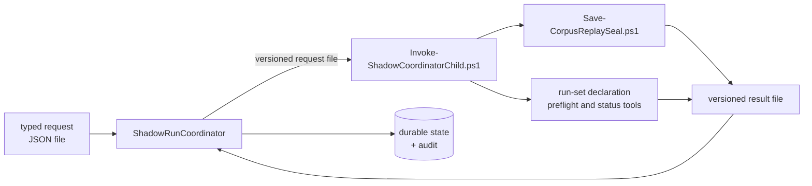

# Shadow run coordinator

`tools/ShadowRunCoordinator` is the first slice of the typed control plane the escape ledger's
`typed-control-plane-pivot` decision registers. It is a dependency-free .NET 10 console
application that carries one shadow preparation from a typed request to an immutable,
signed `run-set-ready` state — and stops there.

> **It launches no model and no slot, and it writes nothing outside its own output root.**
> That is not a convention. The audit it emits records `modelInvocationCount` and
> `slotLaunchCount`, the suite asserts both are zero, and there is no model client, provider
> credential, HTTP type or prompt string anywhere in the project for one to be made from.
> `tools/Test-ReviewerCoordinatorContract.ps1` fails the build if that stops being true.

## What it is for

The reviewer's preparation path is PowerShell, and it stays PowerShell. What moves here is
*coordination*: the ordering of steps, the durability of the state between them, the
supervision of child processes, and the refusal of anything that does not match its contract.
Those are the failure modes the escape ledger's incident list is made of, and they are the
ones a typed, compiled host is actually better at.

Judgement does not move. No prompt text, no model name, no candidate severity, no verdict
rule, and no reconciliation semantics exist in this project. When the coordinator needs one of
those, it invokes the already-reviewed PowerShell tool that owns it.

## The strangler seam



Every arrow crossing the seam is a **file**. The coordinator writes a request file, starts one
child, waits for it under a bounded timeout, and reads a result file. Standard output is
captured to a log and is never a contract surface: a child that prints a perfectly well-formed
result to stdout and writes nothing to its result path has failed.

One child at a time, always. A second child requested while one is in flight is a refusal, not
a queue — concurrency here would mean two writers on one output root, which is the thing the
lease exists to prevent.

## The state machine

```
requestValidated -> corpusValidated -> recipePlanned -> snapshotValidateOnly
    -> snapshotSealed -> snapshotVerified -> runSetDeclared -> runSetVerified -> runSetReady
```

There is no other order and no way to skip. Each transition appends a record to a durable
state file under a monotonic sequence, and the file is replaced atomically. Restarting the
coordinator at any point re-reads that file, recognises the transitions already recorded, and
resumes at the next one — it does not re-run a child whose transition is already committed.

Each transition record carries the evidence it was committed on and a digest over that
evidence. The audit is built from those records rather than from anything the process
accumulated in memory, so an audit written after a restart is identical to one written by a
run that was never interrupted. That is the property that makes "kill it anywhere" a test
rather than a hope.

`--halt-after <state>` stops deliberately after a named transition and exits 9. It exists so
the suite can stop the process at every single transition and start it again.

## Refusals

The request is strict JSON, UTF-8 with no byte-order mark, read from a file. It is refused for
an unknown field, a missing field, a null where a value is required, a scalar where an object
or array belongs, a byte-order mark, a truncated document, an empty file, a top-level array,
and a nesting depth beyond 32. The same strictness applies to every child result.

Beyond shape, the run is refused when:

* the repository head is not the exact commit the request binds,
* a configuration, prompt-asset or schema digest does not match what the request declared,
* the corpus index digest does not match the corpus on disk,
* the durable state file's own integrity check fails, or its correlation ID is not this run's,
* a signing key exists in the output root but the state record it was minted alongside does not,
* another live process holds the lease on the output root.

A child result is refused, even when it is genuine, correlated and correctly digested, when it
disagrees with the record about *which subject* it is describing. A signature proves a run set
was declared under this output root's key; one key signs every declaration in a root, so a
declaration left behind by an earlier subject verifies perfectly. So the verified manifest's
snapshot must be the snapshot this preparation sealed, the status read's set must be the set the
previous transition verified, and the declaring child re-reads a standing declaration's manifest
and adopts it only when its snapshot, manifest digest and planned run count match this request.

The lease records the holder's process ID *and* its process start time, and liveness is decided
by looking up that exact identity. A recycled process ID with a different start time is not the
holder. Nothing reads a command line to decide whether a process is alive. A lease whose holder
cannot be alive is treated as abandoned rather than as a permanent conflict, so a crash cannot
wedge an output root for ever.

Exit codes: `0` ok, `1` usage, `2` request contract, `3` lease conflict, `4` child failure,
`9` deliberate halt.

## Stage artifacts

`src/Agents/reviewer/ShadowPreparation.ps1` is the shipping entry point that turns on the stage
file contract and publishes all twelve stage artifacts. The coordinator rereads every one of
them through the strict reader and indexes them by kind, byte length and digest; its audit does
not close unless all twelve distinct kinds are present and every one was reread.

This is what moved the file contract from "built and CI-verified" to "in force" in
`docs/escape-ledger.v2.json`: not a document saying so, but a compiled consumer that cannot
reach its terminal state without the files.

## Rollback

The PowerShell preparation path is unchanged and remains the default; nothing routes to the
coordinator unless a caller runs it. `tools/Test-ShadowRunCoordinator.ps1` runs the same
request down both paths and compares the twelve published artifacts byte for byte.

Read that for what it is. It proves the two paths *publish* the same stage artifacts; it does
not prove anything about reviewer decisions, because neither path makes one. There is no
reviewer judgement in this slice to differ.

## The pre-commit window

The one fault a state machine cannot halt its way out of: a child completes a durable,
non-repeatable side effect and its coordinator dies before committing the transition. The
sealer refuses an existing snapshot id without `-Force`, and the qualification tool refuses a
second declaration, so a naive resume re-runs the identical step, fails identically, and the
output root is wedged for good.

Two layers close it, and neither uses `-Force` - forcing would let a different request
silently overwrite sealed evidence:

- The **invoker** adopts an existing, valid, successful result for the same step, correlation
  id and child-request digest instead of relaunching. Launch intent is journalled atomically
  before the process starts.
- The **child** adopts its own already-published side effect after re-verifying it through the
  production loader, and reports `adopted` so the adoption is visible in the record.

Two things deliberately do *not* recover. A run whose signed state file is destroyed fails
closed rather than re-deriving a record over standing artifacts - if it could, the record
would not be load-bearing. That refusal is raised from the signing key's own presence, before
anything is mutated, rather than later by happening to trip over a standing side effect: a key
is minted with the first record, so a key without a record is proof a record was removed. And a
resumed run refuses any child result whose bytes are not the ones its own committed record
binds, and rehashes every censused stage artifact before inheriting it - refusing outright if
that census is absent or malformed, rather than treating an unreadable census as an empty one.

The stage preparation step is separately made re-enterable by clearing its declared artifact
directory before publishing, because the stage writer names artifacts by a per-call sequence
and a lost attempt's twelve artifacts would otherwise accumulate into a census of twenty-four.
The sweep is narrowed to this producer's own `*.stage.json` output and each artifact's
`.reservation` sibling. A blanket `*.json` sweep would take the directory's ownership marker
with it, and the stage switch refuses to adopt a populated directory carrying no marker - so
the cleanup that exists to make the retry possible would be the thing that made it impossible.

## What the audit may claim

The audit is written from the durable record, not from what this process happened to do. Its
child-backed transition census counts committed transitions carrying a child-result digest, so
a run that resumes over work an earlier process did reports the same census as an uninterrupted
one; a per-process counter structurally could not support the "no duplicate launch" claim it was
there to make. The model and slot censuses are *omitted* rather than published as null when the
run stopped short of readiness and never observed them, because `[int]$null` is `0` in
PowerShell and an unobserved run would otherwise read as a clean zero; `invariantCountsObserved`
says which of the two an audit is.

## Tests

`tools/Test-ShadowRunCoordinator.ps1` (CI, offline, no model) covers: an offline restore and
build against an empty feed; a hermetic sandbox with a genuinely sealed synthetic corpus; a
kill and restart at *every* transition; the full path to `run-set-ready`; the twelve-artifact
audit; the stage publication differential; the request boundary matrix; stale head, stale
identity and tampered state; the lease conflict and the abandoned-lease recovery; the child
fault matrix (non-zero exit, missing, malformed, byte-order-marked, truncated, partial, wrong
correlation, wrong step, stdout chatter, a stray publication directory, a mismatched request
digest, and a hang bounded by timeout); an external kill mid-transition; the pre-commit window
on both non-repeatable side effects and on the stage publication; resume integrity against
edited child results and edited stage artifacts; the changed-path census boundary; a run set
that belongs to another preparation, refused both at the child's adoption and at the
coordinator's own snapshot and set bindings; the audit's resume-invariance and its refusal to
publish a census it never observed; and a final check that no child process and no repository
modification survived the run.

The canonical key order that makes any of this reproducible is covered in
`tools/Test-ReviewerStageContract.ps1`, which asserts the same bytes under `en-US`, `da-DK`,
`tr-TR` and `sv-SE`; asserts that a hashtable, an ordered dictionary and a `PSCustomObject`
holding the same content serialize identically; and asserts that a dictionary whose keys are not
strings keeps its values rather than publishing nulls, and that two keys projecting to the same
text are refused rather than silently reduced to one.
