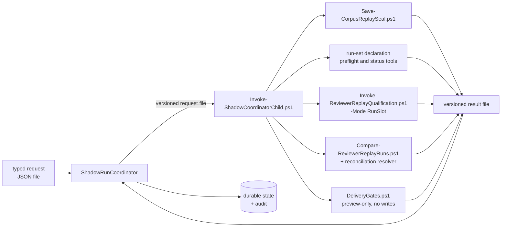

# Shadow run coordinator

`tools/ShadowRunCoordinator` is the typed control plane the escape ledger's
`typed-control-plane-pivot` decision registers. It is a dependency-free .NET 10 console
application that carries one shadow preparation from a typed request to an immutable,
signed `run-set-ready` state, and — in its third slice, and only when the request explicitly
authorizes it — supervises **exactly two** declared replay-qualification slots to verified
terminals and then has the reviewed comparison reconcile them.

> **It writes nothing outside its own output root, and it makes no reviewer decision.**
> The coordinator holds no prompt text, no model name, no candidate, no severity and no
> verdict rule; there is no model client, provider credential or HTTP type anywhere in the
> project for one to be made from. `tools/Test-ReviewerCoordinatorContract.ps1` fails the
> build if that stops being true.
>
> By default it also launches nothing: the target state is `runSetReady`, `slotLaunchCount`
> is zero, and the suite asserts it. A request that carries no `slots` section, or one that
> sets `shadowSlotsEnabled` to `false`, cannot reach a slot state at all; a request whose
> `slots.reconciliation` is absent or disabled cannot reach a reconciliation state. When a
> slot *is* authorized, the process it starts is the already-reviewed PowerShell
> qualification runner, which is what invokes models. The coordinator supervises that
> process — it does not read its findings. Model attempts reach the audit only as
> `slotModelInvocationCount`, an opaque passthrough of what the reviewed verifier read out of
> the owner's terminal artifact. The reconciliation is the same arrangement one level up: the
> comparison is `tools/Compare-ReviewerReplayRuns.ps1`, unchanged, and what returns to the
> coordinator is a status word, four digests and a census of integers it copies without
> reading.

## What it is for

The reviewer's preparation path is PowerShell, and it stays PowerShell. What moves here is
*coordination*: the ordering of steps, the durability of the state between them, the
supervision of child processes, and the refusal of anything that does not match its contract.
Those are the failure modes the escape ledger's incident list is made of, and they are the
ones a typed, compiled host is actually better at.

Judgement does not move. No prompt text, no model name, no candidate severity, no verdict
rule, and no reconciliation semantics exist in this project. When the coordinator needs one of
those, it invokes the already-reviewed PowerShell tool that owns it.

## The strangler seam



Every arrow crossing the seam is a **file**. The coordinator writes a request file, starts one
child, waits for it under a bounded timeout, and reads a result file. Standard output is
captured to a log and is never a contract surface: a child that prints a perfectly well-formed
result to stdout and writes nothing to its result path has failed.

One child at a time, always. A second child requested while one is in flight is a refusal, not
a queue — concurrency here would mean two writers on one output root, which is the thing the
lease exists to prevent. The supervised slot is the same seam with a longer wait: the same
single child, the same request and result files, watched under the plan's own deadlines instead
of a fixed step timeout.

## The state machine

```
requestValidated -> corpusStaging -> corpusPublished -> corpusValidated -> recipePlanned
    -> snapshotValidateOnly
    -> snapshotSealed -> snapshotVerified -> runSetDeclared -> runSetVerified -> runSetReady
    -> slot1Authorized -> slot1Launching -> slot1Running -> slot1TerminalObserved
    -> slot1TerminalVerified | slot1TerminalFailed | slot1TerminalTimedOut
    -> slot2Authorized -> slot2Launching -> slot2Running -> slot2TerminalObserved
    -> slot2TerminalVerified | slot2TerminalFailed | slot2TerminalTimedOut
    -> reconciliationAuthorized -> reconciliationLaunching -> reconciliationRunning
    -> reconciliationTerminalObserved -> reconciliationVerified
    -> deliveryAuthorized -> deliveryLaunching -> deliveryRunning
    -> deliveryTerminalObserved -> deliveryTerminalVerified
```

There is no other order and no way to skip. Each transition appends a record to a durable
state file under a monotonic sequence, and the file is replaced atomically. Restarting the
coordinator at any point re-reads that file, recognises the transitions already recorded, and
resumes at the next one — it does not re-run a child whose transition is already committed.

The three terminal states of each slot are siblings, not a sequence: they share one rank, and
they are the three things a finished slot can be. `--target slot1TerminalVerified` therefore
reaches any of them; the exit code, not the target, says which. Everything from
`slot1Authorized` on happens only when the request turns the slots on, so the default path
still stops at `runSetReady`.

Both slots are declared in the request from the moment the request is signed, and the
declaration is what the whole set is prepared against: the run set is planned for exactly two
runs, and there is no transition, argument or code path that adds a third or resumes a set
under a changed declaration. Ordering is enforced twice over. `slot2Authorized` requires this
coordinator's own signed `slot1TerminalVerified` record, and the reconciliation requires both
slots' — so a slot that fails or times out is a slot that closes the set, because
`slot1TerminalFailed` is not `slot1TerminalVerified` and nothing downgrades that. The reviewed
PowerShell readiness gate is asked the same question independently and must also agree.

`reconciliationRunning` is not decoration. The reviewed comparison mints its single-use
attempt record as its first act, so a coordinator killed while the comparison runs comes back
to an authorization that is already spent. Committing the child's identity *before* the wait
is what makes that recoverable: the resumed run adopts the process its own signed record names
instead of concluding that somebody else consumed the one attempt. It is the same shape as
`slot1Running`, for the same reason, and the suite kills the coordinator in exactly that window.

Each transition record carries the evidence it was committed on and a digest over that
evidence. The audit is built from those records rather than from anything the process
accumulated in memory, so an audit written after a restart is identical to one written by a
run that was never interrupted. That is the property that makes "kill it anywhere" a test
rather than a hope.

`--halt-after <state>` stops deliberately after a named transition and exits 9. It exists so
the suite can stop the process at every single transition and start it again.

## Building the corpus

`corpusStaging` and `corpusPublished` exist because a corpus used to be built by a private
script, and the way that script failed is instructive. It copied a captured corpus wholesale —
including the previous run's identity witness — and then tried to overwrite the witness inside
the copy. The captured corpus was read-only, as captured evidence should be, so the overwrite
failed with access denied, and it failed *before* the coordinator had any record that a corpus
was being built at all. The visible symptom was a permission error. The actual defect was that
a corpus's identity was whatever had been inherited from whatever was copied, and nothing typed
was accountable for it.

Both are fixed the same way: the corpus is built from a declaration rather than from a
directory, and it is built in the control plane rather than beside it.

The declaration is `devpilot.shadow-run-coordinator.corpus-stage-request.v1`, named by the
request's optional `corpusStage` section and bound there by digest. It names, per payload, the
corpus-relative path, the absolute source path, the exact SHA-256, the exact byte length, the
form (`utf8Text` or `binary`) and the role. It names the identity witness's fields outright, and
it names the digest the finished index must have. Every source it names is read and never
written, so a read-only source corpus is an ordinary input rather than a failure.

The order is the contract:

1. A journal is written into the coordinator root **before** the staging directory exists, so
   there is no instant at which a staging directory exists that no journal claims.
2. The staging directory is created empty, beside the destination and therefore on its volume.
3. The **identity witness is written first**. A staging directory that exists at all already
   says which subject it is for.
4. Each remaining payload is read once from its immutable source — length checked against the
   declaration, exactly that many bytes read, end-of-file asserted — and the digest compared
   against the declaration is computed over the bytes actually read. A source rewritten between
   a hash and a read cannot pass. Each file is then re-read from disk and re-digested.
5. The index is **generated last**, from the declaration, through the same canonical rendering
   the PowerShell canonicalizer produces. PowerShell remains normative; the C# side has only to
   agree, and it refuses to publish if the index it generated does not digest to what was
   declared.
6. The staged tree is validated as a set: every declared path present, no extras, no
   duplicates, no reparse points, every length and digest re-read.
7. Publication is a single `Directory.Move` onto a path that must not exist. That is what makes
   two concurrent builders resolve to exactly one winner without a lock.
8. The published corpus is made read-only, and the result contract
   `devpilot.shadow-run-coordinator.corpus-stage-result.v1` is written.

A run killed at any point in that sequence leaves either no journal and no directory, or a
journal naming a directory that may be complete, partial or absent — and in every one of those
cases the next run can tell whether the leftovers are its own. It removes only a staging
directory its own journal claims; a journal opened by another correlation is a refusal rather
than a licence to tidy up. A published corpus is never replaced, merged into, or written over:
a destination that already holds a corpus with the digest this run staged is adopted, and one
with any other digest is refused.

Staging is optional. Without a `corpusStage` section both transitions commit
`staged: false` and touch nothing, which is the retained PowerShell default: the corpus is
built the old way and `corpusValidated` reads it exactly as before. They are two ranks rather
than one because the on-disk shape either side of the move is completely different, and a
single rank could not say which side a resumed run was on.

## The supervised slots

The slot slices add no reviewer logic. What runs a slot is
`tools/Invoke-ReviewerReplayQualification.ps1 -Mode RunSlot`, unchanged, reached through the same
one-step-one-file child contract every other transition uses. What the coordinator adds is
authorization, a durable identity for the child, and supervision.

Both slots take the same five states and the descriptions below apply to each, with `slot2`
substituted for `slot1` throughout. What differs is only the gate in front of them: `slot1` may
be authorized once the run set is ready, and `slot2` may be authorized only once this
coordinator's own signed record says `slot1TerminalVerified`. Each slot carries its own
one-shot launch-authorization token, its own nonce, its own state root, its own child step
names and its own exchange files, so no result published for one can be adopted as the other's
answer.

**`slot1Authorized`** is the only state that decides anything. The launch-authorization token
named by the request is compared against the token the run set published beside its declaration —
by digest, and the refusal names neither, so a wrong token is not an oracle. Then the reviewed
`New-ReviewerReplayQualificationPlan` rebuilds the plan under that token's hash, the reviewed
assertions bind it to the signed declaration, and the resulting plan digest, set ID, slot name and
deadlines are committed. From here on the coordinator compares against what it committed, never
against what a later child says.

The deadlines are the *plan's*, not the request's. Hard and activity budgets are the plan's slot
and progress timeouts; the per-call bound is read back out of the slot's sealed argument vector,
which the plan digest covers. The request contributes exactly one number,
`supervisionGraceSeconds` (30–3600), which is how long the supervisor waits past a plan deadline
before it stops the child itself. A plan whose per-call or activity bound exceeds its hard bound
is refused rather than clamped.

**`slot1Launching`** re-probes eligibility immediately before the irreversible step, through a
separate `slotPrelaunch` child whose previous result is deleted first. Adoption is right for work
that must not repeat and wrong for a probe, so the probe does not share the plan step's result
file. If an attempt record or terminal artifact has appeared since authorization, the single-use
launch has already been spent and the run refuses rather than starting a second one.

**`slot1Running`** is committed *before* the wait, carrying the child's process ID, its process
start time, the digest of the child request and the attempt number. This ordering is the whole
point: a coordinator killed during an hour-long slot must be able to name what it left behind.
A process whose start time cannot be read is half-identified, and half an identity is none: it
could not be told apart from whatever the operating system later gives that process ID to. Such a
child is stopped at launch and the run fails, rather than being supervised or left unowned.

**`slot1TerminalObserved`** is the wait. A resumed run adopts the child its own signed
`slot1Running` record names — matched on process ID *and* start time — instead of launching
another. Both halves must be present and equal; an unreadable start time on either side is never
a match, so an unrelated process that inherited the ID is neither waited on nor killed. The
lease's live-child refusal makes an exception for exactly that identity, derived from
the signed record rather than from the forgeable journal, and for nothing else. When a deadline
expires the child's whole process tree is stopped, output is drained with a bound, and the run
reports the kill rather than reading whatever the corpse left. Stopping a tree is best effort by
construction — a descendant that was already exiting cannot be killed again — so a partial kill
never becomes the run's error. What settles the outcome is the bounded wait and the artifact the
child did or did not write, and the journal entry is always cleared either way.

**`slot1TerminalVerified`** hands the terminal artifact back to the reviewed verifier and to the
reviewed inventory census, then checks what came back against the committed record: the artifact's
kind and version, its slot, its set ID, its plan digest, that it is read-only, that its status and
its timeout flag do not contradict each other, that exactly one attempt record exists, and that its
digest is the one this run observed. `complete` commits `slot1TerminalVerified` and exits 0;
`failed` and `timedOut` commit `slot1TerminalFailed` or `slot1TerminalTimedOut` and exit 5. Those
are outcomes, not errors: a qualification slot that fails is *supposed* to exit non-zero.

Everything inside the terminal artifact — findings, verdicts, severities, candidate text, model
names, attempt counts — is opaque. The coordinator indexes it, digests it and refuses on its
shape; it never reads it for meaning. `tools/Test-ReviewerCoordinatorContract.ps1` enforces that
mechanically: the C# sources may not mention prompts, models, severities, candidates, verdicts or
provider writes at all.

Model names are not an exception to that. A slot's request may carry an `opaqueArguments` list
and a model plan, both of which are strings inside the signed request, and both of which the
coordinator forwards verbatim to the child and never inspects. They exist so the operator can
say which reviewed configuration each slot runs; the coordinator has no branch that reads them,
and the contract suite fails if one appears.

## The reconciliation

The set closes with one comparison of its two runs, and the comparison is
`tools/Compare-ReviewerReplayRuns.ps1` followed by the reviewed reconciliation resolver —
unchanged, reached through the same child contract, and invoked *without* the switch that turns
disagreement into a non-zero exit. Reacting to disagreement is precisely the judgement this
coordinator must not make. What it requires instead is that the comparison ran, sealed its
artifact, and wrote its summary.

The exchange is two versioned files under the coordinator's own output root. The coordinator
publishes `reconciliation-request.json`
(`devpilot.shadow-run-coordinator.reconciliation-request.v1`), commits its digest, and the child
refuses to act on any other bytes. The child writes back
`reconciliation-summary.json` (`…reconciliation-summary.v1`) at the one path the request names.
Nothing passes between them on a command line or through an environment variable.

**`reconciliationAuthorized`** requires this coordinator's own signed `slot1TerminalVerified`
*and* `slot2TerminalVerified`, and independently requires the reviewed readiness gate to agree
that the set is reconcilable. It commits the set ID, the plan digest and the required run count,
which must equal the declaration's planned run count of two.

The one run each slot offers is found where the reviewer writes it — under
`<slot-state>/replay/<snapshot>/convention-specialist-previews`, beside the signing key that
opens it — and the snapshot naming that directory is the one *the plan seals*, never one read
off the disk. A slot state directory that has replayed two snapshots therefore still offers the
reconciliation exactly one candidate, and a sibling left by some other snapshot can never be it.

**`reconciliationLaunching`** publishes the input document and commits its digest.

**`reconciliationRunning`** commits the child's identity before the wait, for the reason given
in the state machine section: the comparison's attempt record is single-use and is minted before
the comparison starts, so without this record a crash in that window would leave the set
permanently unreconcilable.

**`reconciliationTerminalObserved`** reads the summary, rehashes it, checks it was written where
the request asked, and pins the two files the comparison produced — the Markdown report and the
sealed artifact — by path and digest, taken where they were made.

**`reconciliationVerified`** has the reviewed reader parse the sealed artifact and checks what
comes back against what was committed: the seal verifies under its key, the sealed
declaration is *this* run set's and plans *this* many runs, the sealed report digest matches the
report on disk, the report and artifact are the same two files this run watched being produced,
the comparison covered exactly the declared number of runs, and the artifact does not claim to
be promotable — an evaluation-only reconciliation never is. What the coordinator then records is
a status word, four digests, two run counts and an ordered census of name/value integers copied
across unread. No finding identity, no text, no severity and no verdict crosses that boundary.

## The delivery decision

The set may close with one *preview-only* delivery decision, and there is no other kind. The
decision is produced by the reviewed `src/Agents/reviewer/DeliveryGates.ps1` — unchanged,
reached through the same child contract, evaluated with every write switch off. Whether a
finding is worth surfacing, and to whom, is judgement this coordinator must not make; what it
requires instead is that the evaluation ran, sealed its decision, and reported that it wrote
nowhere.

Delivery is declared in the request at creation, next to the slots and the reconciliation, or
not at all. There is no argument, transition or code path that turns one on later, and the
declaration is refused unless it names `authorizationKind: "PreviewOnly"`, sets
`commentsEnabled`, `votesEnabled` and `gatesEnabled` to false, and sets `providerWriteBudget`
to `0`. A declaration that asks for anything else is not a delivery this build can run.

The exchange is two versioned files under the coordinator's own output root. The coordinator
publishes `delivery-request.json` (`devpilot.shadow-run-coordinator.delivery-request.v1`),
commits its digest, and the child refuses to act on any other bytes. That document is what
binds the decision to everything it was made from: the sealed snapshot, the declared run set,
the verified reconciliation and its sealed artifact, the config and policy digests, the
required head, and the correlation this run carries. The child writes back
`delivery-summary.json` (`…delivery-summary.v1`) at the one path the request names. Nothing
passes between them on a command line or through an environment variable.

**`deliveryAuthorized`** requires this coordinator's own signed `slot1TerminalVerified`,
`slot2TerminalVerified` *and* `reconciliationVerified`, and independently requires the reviewed
readiness gate to agree. It commits the set ID, the plan digest, the required run count, the
reconciliation digest the decision must close over, and the capability the plan reports. That
capability is not the adapter's own abstinence: the reviewed authority is asked with every
write switch *on*, so what comes back says what the live policy would permit if a write were
asked for, not what this run happened to ask for. Any write capability in reach — a kind other
than `PreviewOnly`, comments, votes or gates on, a promotable outcome, or a non-zero write
count — stops the run *here*, before a child is launched.

**`deliveryLaunching`** publishes the input document and commits its digest.

**`deliveryRunning`** commits the child's identity before the wait, for the same reason the
comparison does: the delivery's attempt record is single-use and is minted before the
evaluation starts.

**`deliveryTerminalObserved`** reads the summary, rehashes it, checks it was written where the
request asked, pins the sealed decision by path and digest, and refuses any reported write.

**`deliveryTerminalVerified`** has the reviewed reader parse the sealed decision and checks what
comes back against what was committed: the seal verifies under its key, the decision is *this*
run set's, it closes over *this* reconciliation, it covered exactly the declared number of runs,
it does not claim to be promotable, it still reports `PreviewOnly` with every capability off,
and both `providerWriteCount` and `writeToolInvocations` are zero. What the coordinator then
records is a status word, three digests, one run count, four flags and an ordered census of
name/value integers copied across unread. It never compares that status word to a literal, and
it has no branch on which one it got: a decision that found nothing, one that let nothing
through, one that would be eligible in preview and one built over a run the comparison called
unusable all reach the same terminal and record the same two zeroes.

## Refusals

The request is strict JSON, UTF-8 with no byte-order mark, read from a file. It is refused for
an unknown field, a missing field, a null where a value is required, a scalar where an object
or array belongs, a byte-order mark, a truncated document, an empty file, a top-level array,
and a nesting depth beyond 32. The same strictness applies to every child result.

Beyond shape, the run is refused when:

* the repository head is not the exact commit the request binds,
* a configuration, prompt-asset or schema digest does not match what the request declared,
* the corpus index digest does not match the corpus on disk,
* a corpus stage declaration disagrees with the request that carries it — a different
  correlation, toolkit head, output root, corpus root, index digest or subject identity,
* a corpus stage declaration is not internally sound: a path that is not a canonical corpus
  path, a payload declared twice or aliased by case, two payloads reading one source, payloads
  out of ascending ordinal order, an index declared as a payload, no identity witness or more
  than one, a witness whose path is not the one the identity names, or a missing mandatory role,
* a declared source does not exist, is a reparse point, is a different length, grew while it was
  being read, digests to something other than the declaration, or — where the payload is
  declared textual — opens with a byte-order mark or is not valid UTF-8,
* a corpus destination already exists when staging begins, appears between the check and the
  move, or already holds a corpus whose index digests to something other than what this run
  staged,
* a staging journal in this output root was opened by another correlation, for another request,
* the durable state file's own integrity check fails, or its correlation ID is not this run's,
* a signing key exists in the output root **and** that root holds standing work — an audit,
  exchange records, stage artifacts, a replay root or a qualification root — but the state
  record those were produced under does not. A key on its own is not that condition: a first
  attempt refused for an ordinary reason (a mistyped digest, a moved toolkit, a head that has
  since advanced) has published nothing, and the corrected second attempt against the same root
  must work. The key is therefore written from inside the save that produces the record it
  signs, so the two exist together or not at all,
* the recipe file named by the request no longer hashes to the digest `corpusValidated` recorded
  for it. A resume skips the validation that blessed the recipe, so the seal re-checks the
  content it is about to consume — in the coordinator before the child request is built, again
  in the child, and finally inside the sealer itself: `Save-CorpusReplaySeal.ps1` takes an
  optional `-RecipeSha256` and checks it over the exact bytes it parses, which is what closes
  the window rather than narrowing it, because those bytes are never read a second time. The
  child's other read of the recipe — the one that derives the deterministic snapshot id used to
  decide whether an already published snapshot can be adopted — carries the same digest, so a
  swap cannot steer adoption at a snapshot the request never bound either,
* another live process holds the lease on the output root,
* a child this output root's launch journal records as running is still alive. A coordinator
  killed from outside never runs its own cleanup, so the `pwsh` it started outlives it; the
  lease handle closes but the writer does not stop. The journal records the child's process ID
  *and* its start time at the moment it starts and clears them when it exits, so the next run
  refuses while that exact process is alive and proceeds once it is gone. The journals are read
  twice: once before the lease is taken, for an early and friendlier refusal, and once from
  inside the lease, which is the check that settles it — the first one on its own races a
  coordinator that starts a child and is killed in the window before this one acquires.

Liveness is always re-derived from the live process table and never trusted from a file, so a
journal left behind by a crash, a full disk or a machine that was rebooted cannot wedge an output
root: the recorded process is simply gone. A recorded identity that matches only by process ID
is not the child either, so a recycled ID can produce a false conflict — which is safe — but
never a false clearance.

A child result is refused, even when it is genuine, correlated and correctly digested, when it
disagrees with the record about *which subject* it is describing. A signature proves a run set
was declared under this output root's key; one key signs every declaration in a root, so a
declaration left behind by an earlier subject verifies perfectly. So the verified manifest's
snapshot must be the snapshot this preparation sealed, the status read's set must be the set the
previous transition verified, and a standing declaration is adopted only when it was sealed
under the *whole* plan this request would have declared.

That last binding is the production one, not a paraphrase. The declaring child rebuilds the
qualification plan with `New-ReviewerReplayQualificationPlan`, reproduces the launch-authorization
hash by reading the token the declaration itself minted — the plan digest binds that hash, and
`Declare` mints it at random, so the token is the only way to reproduce the plan — and then binds
the standing declaration through `Get-VerifiedRunSetDeclaration` and
`Assert-ReviewerQualificationDeclarationMatchesPlan`. The plan digest covers the reviewed
repository, the config, the operator, the commit and ref, the models, the timeouts and every slot
argument vector, so a declaration that agrees on snapshot, manifest digest and run count but was
made for a different qualification is refused. A declaration whose token is gone is not adoptable
either: without it the plan cannot be reproduced, and adopting on the strength of the fields that
remain is exactly the substitution this check exists to refuse. Verification failure and plan
mismatch share one refusal, because adoption is a positive proof and anything that stops the
proof means the set is not this preparation's.

The lease records the holder's process ID *and* its process start time, and liveness is decided
by looking up that exact identity. A recycled process ID with a different start time is not the
holder. Nothing reads a command line to decide whether a process is alive. A lease whose holder
cannot be alive is treated as abandoned rather than as a permanent conflict, so a crash cannot
wedge an output root for ever.

A supervised slot is refused when:

* the request turns the slot on but names no launch-authorization token, or names one that is
  not the token the published run set carries,
* the qualification plan the reviewed builder produces under that token does not bind to the
  signed declaration,
* an attempt record or terminal artifact already exists at authorization or reappears between
  authorization and launch — the launch is single-use, and a second one is not a wasted run but
  an unrecoverable one,
* the plan's own deadlines are inconsistent: a hard bound of zero, or a per-call or activity
  bound larger than the hard bound,
* the child was stopped by this coordinator on a plan deadline. The run reports the kill; it does
  not summarise a run it ended itself,
* the child exited leaving no result, or a result that is absent, malformed, wrongly correlated
  or wrongly digested,
* the terminal artifact is missing, writable, of the wrong kind or version, for another slot,
  for another run set, sealed under another plan digest, self-contradictory about its timeout, or
  accompanied by anything other than exactly one attempt record,
* the terminal artifact's digest is not the one this run observed before it committed
  `slot1TerminalObserved`. The artifact is written read-only by its owner, so a changed digest is
  a tamper rather than a race.

`slot2` adds one refusal to that list: it is refused unless this coordinator's own signed record
already says `slot1TerminalVerified`. `slot1TerminalFailed` and `slot1TerminalTimedOut` are not
that, so a slot that fails or times out closes the set — and the set stays closed, because
nothing in this build re-authorizes a spent slot or resumes a set under a changed declaration.

A reconciliation is refused when:

* either declared slot is not verified complete in this coordinator's own signed record, or the
  reviewed readiness gate does not independently agree the set is reconcilable,
* the reviewed plan is for another run set, digests differently than the digest the
  authorization was committed against, or plans a different number of runs than the declaration,
* a comparison attempt record already exists at authorization or appears between authorization
  and launch — the comparison, like a slot launch, is single-use,
* the child was stopped by this coordinator on a plan deadline, or exited leaving no result, or
  a result that is absent, malformed, wrongly correlated or wrongly digested,
* the comparison wrote no summary, wrote it somewhere other than the one path the request named,
  or wrote one whose bytes do not digest to what the child reported,
* the sealed artifact does not verify under its key, declares another kind, carries no
  declaration, is for another run set, plans a different run count, or binds a report digest that
  is not the report on disk,
* the report or the artifact offered to the verification step is not the same file, with the same
  bytes, that this run watched the comparison produce,
* the comparison covered a different number of runs than the set requires, or the artifact claims
  to be promotable,
* the opaque census is empty, names anything twice, or names anything that is not a plain
  alphanumeric identifier.

Exit codes: `0` ok, `1` usage, `2` request contract, `3` lease conflict, `4` child failure,
`5` a slot that finished failed or timed out, `9` deliberate halt.

## Stage artifacts

`src/Agents/reviewer/ShadowPreparation.ps1` is the shipping entry point that turns on the stage
file contract and publishes all twelve stage artifacts. The coordinator rereads every one of
them through the strict reader and indexes them by kind, byte length and digest; its audit does
not close unless all twelve distinct kinds are present and every one was reread.

This is what moved the file contract from "built and CI-verified" to "in force" in
`docs/escape-ledger.v2.json`: not a document saying so, but a compiled consumer that cannot
reach its terminal state without the files.

## Rollback

The PowerShell preparation path is unchanged and remains the default; nothing routes to the
coordinator unless a caller runs it, and nothing runs a slot unless that caller also turns the
slot on in the request and hands over the run set's own launch-authorization token.
`tools/Test-ShadowRunCoordinator.ps1` runs the same request down both paths and compares the
twelve published artifacts byte for byte.

Read that for what it is. It proves the two paths *publish* the same stage artifacts; it does
not prove anything about reviewer decisions, because neither path makes one. There is no
reviewer judgement in this slice to differ.

Rolling back the slot slice is deleting the `slots` section from the request. The reviewed
`RunSlot` path is reached through the same arguments it has always been reached through, so
running it directly is the rollback, not a fallback that has to be built. Rolling back only the
reconciliation is deleting `slots.reconciliation`, or setting `reconciliationEnabled` to false:
the set then stops at `slot2TerminalVerified` and the reviewed comparison is run by hand exactly
as it always was.

Rolling back the delivery slice is deleting `slots.delivery`, or setting `deliveryEnabled` to
false: the set then stops at `reconciliationVerified` and the reviewed `DeliveryGates.ps1` is
run by hand exactly as it always was, with whatever switches its own operator is entitled to
use. The coordinator's copy of that decision is preview-only in every configuration it will
accept, so removing it removes a decision that could never have written anything anyway.

Rolling back the corpus staging slice is deleting the `corpusStage` section from the request.
Both corpus transitions then commit `staged: false`, the coordinator reads a corpus somebody
else built exactly as it did before, and the PowerShell path that builds one is untouched.

## The pre-commit window

The one fault a state machine cannot halt its way out of: a child completes a durable,
non-repeatable side effect and its coordinator dies before committing the transition. The
sealer refuses an existing snapshot id without `-Force`, and the qualification tool refuses a
second declaration, so a naive resume re-runs the identical step, fails identically, and the
output root is wedged for good.

Two layers close it, and neither uses `-Force` - forcing would let a different request
silently overwrite sealed evidence:

- The **invoker** adopts an existing, valid, successful result for the same step, correlation
  id and child-request digest instead of relaunching. Launch intent is journalled atomically
  before the process starts.
- The **child** adopts its own already-published side effect after re-verifying it through the
  production loader, and reports `adopted` so the adoption is visible in the record.

Two things deliberately do *not* recover. A run whose signed state file is destroyed fails
closed rather than re-deriving a record over standing artifacts - if it could, the record
would not be load-bearing. That refusal is raised from the signing key's own presence, before
anything is mutated, rather than later by happening to trip over a standing side effect: a key
is minted with the first record, so a key without a record is proof a record was removed. And a
resumed run refuses any child result whose bytes are not the ones its own committed record
binds, and rehashes every censused stage artifact before inheriting it - refusing outright if
that census is absent or malformed, rather than treating an unreadable census as an empty one.

The stage preparation step is separately made re-enterable by clearing its declared artifact
directory before publishing, because the stage writer names artifacts by a per-call sequence
and a lost attempt's twelve artifacts would otherwise accumulate into a census of twenty-four.
The sweep is narrowed to this producer's own `*.stage.json` output and each artifact's
`.reservation` sibling. A blanket `*.json` sweep would take the directory's ownership marker
with it, and the stage switch refuses to adopt a populated directory carrying no marker - so
the cleanup that exists to make the retry possible would be the thing that made it impossible.

## What the audit may claim

The audit is written from the durable record, not from what this process happened to do. Its
child-backed transition census counts committed transitions carrying a child-result digest, so
a run that resumes over work an earlier process did reports the same census as an uninterrupted
one; a per-process counter structurally could not support the "no duplicate launch" claim it was
there to make. The model and slot censuses are *omitted* rather than published as null when the
run stopped short of readiness and never observed them, because `[int]$null` is `0` in
PowerShell and an unobserved run would otherwise read as a clean zero; `invariantCountsObserved`
says which of the two an audit is.

The slots' own fields are separate from the readiness census, and the distinction matters:
`slotLaunchCount` and `modelInvocationCount` are what the reviewed verifier saw *at
run-set-ready*, when by definition nothing has run yet, so both are zero on a healthy run. The
per-slot census taken after each slot finished is indexed under `slots`, one entry per declared
slot in declaration order, each carrying `slotName`, `slotAttemptCount`,
`slotModelInvocationCount`, `slotTerminalStatus`, `slotTerminalExitCode`, `slotTerminalTimedOut`
and `slotTerminalSha256`, beside `declaredSlotCount` and `supervisedSlotCount` so a partly
supervised set cannot read as a complete one. The model count is a passthrough: the coordinator
neither produces it nor interprets it, and publishes it exactly as the reviewed inventory
reported it. The slot fields are omitted entirely when no slot was authorized, for the same
reason the readiness census is — a zeroed slot block would read like a slot that ran and did
nothing.

`slotSupervision` reports how each wait ended, and only what this coordinator can actually know:
the disposition, the child's exit code, whether the supervisor stopped it, the recorded identity,
the observed span, and whether the observation crossed a restart.

The reconciliation's fields are `reconciliationPerformed`, `reconciliationStatus`,
`reconciliationSha256`, `reconciliationReportSha256`, `reconciliationArtifactSha256`,
`reconciliationSummarySha256`, `reconciliationRunCount`, `reconciliationPromotable` and the
ordered `reconciliationCounts` census. Every one of them is either a digest, a count, or a word
the reviewed tool chose; none is a reading of what the comparison found.
`reconciliationPerformed` is false on any run that refused, so a blocked or failed set never
publishes an audit that claims a comparison happened.

`deliveryMode` is always `previewOnly` and `providerWriteCount` and `writeToolInvocations` are
always `0`, because there is no write-enabled transition in this build. When a delivery was
declared and reached its verified terminal the audit also carries `deliveryPerformed`,
`deliveryAuthorizationKind` (always `PreviewOnly`), `deliveryStatus`, `deliveryDecisionSha256`,
`deliverySummarySha256`, `deliveryReconciliationSha256`, `deliveryRunCount`,
`deliveryPromotable`, `deliveryCommentsEnabled`, `deliveryVotesEnabled`, `deliveryGatesEnabled`
and the ordered `deliveryCounts` census. Every one of them is a digest, a count, a flag, or a
word the reviewed tool chose. `deliveryPerformed` is false on any run that refused, so a blocked
delivery never publishes an audit that claims a decision happened — and the two write counts
read zero on those runs too.

## Tests

`tools/Test-ShadowRunCoordinator.ps1` (CI, offline, no model) covers: an offline restore and
build against an empty feed; a hermetic sandbox with a genuinely sealed synthetic corpus; a
kill and restart at *every* transition; the full path to `run-set-ready`; the twelve-artifact
audit; the stage publication differential; the request boundary matrix; stale head, stale
identity and tampered state; the lease conflict and the abandoned-lease recovery; the child
fault matrix (non-zero exit, missing, malformed, byte-order-marked, truncated, partial, wrong
correlation, wrong step, stdout chatter, a stray publication directory, a mismatched request
digest, and a hang bounded by timeout); an external kill mid-transition; the pre-commit window
on both non-repeatable side effects and on the stage publication; resume integrity against
edited child results and edited stage artifacts; the changed-path census boundary; a run set
that belongs to another preparation, refused both at the child's adoption — including a
declaration made for a different operator that agrees on snapshot, digest and run count — and at
the coordinator's own snapshot and set bindings; the audit's resume-invariance and its refusal to
publish a census it never observed; a root whose first attempt was refused before it published
anything and which must therefore still be usable, alongside the wiped-record refusal that same
guard exists for; a recipe rewritten between validation and the seal; a still-live recorded child
refusing the next run and then releasing it once that child exits; and a final check that no
child process and no repository modification survived the run.

For the typed corpus staging it adds two scenarios. The first builds a corpus from a genuinely
read-only source corpus into a destination that does not exist, halts after `corpusStaging` and
checks that nothing was published and that the scratch directory already carries its identity
witness and an index digesting to what the declaration bound, resumes to a signed run set,
and then checks that the published index is byte-identical to the one the PowerShell
canonicalizer produced, that the binary payload survived verbatim, that every published file is
read-only, that the journal is gone and no staging directory is left, that the stage result says
what was built, that the source corpus is unchanged and still read-only, and that a replay
rewrites nothing.

The second is the fault matrix: a destination that already exists; a source rewritten after the
declaration was written; a byte-order mark and invalid UTF-8 on a payload declared textual; a
missing source; a duplicated path; a traversal path; the index declared as a payload; payloads
out of order; a witness alias; a wrong subject and a wrong commit; a foreign correlation; a
wrong index digest; a relabelled corpus kind; a declaration edited after the request bound its
digest; a source locked against reading part way through a staging, followed by the same request
succeeding once it is readable again; a staging directory destroyed while its owner was dead; a
journal another run opened, which is refused rather than cleaned up; a destination parent that is
a reparse point; and two builders started together against one destination, of which exactly one
may perform the move. Every refusal is held to the same three properties: a contract exit, a
refusal naming the fault, and nothing published and nothing left behind.

For the supervised slot it adds: an authorization built by the production plan builder against
the real signed declaration, with no stand-in anywhere, refused for a missing token and for a
token that is not the published one; a halt and a resume at every one of the four slot states,
with the sequence and the attempt census checked after each, so a resume that relaunched would
fail; a coordinator killed while its slot child is genuinely still running, and a second run that
adopts that exact child rather than starting another; a spent authorization consumed behind the
coordinator's back; the three terminal endings; and the slot fault matrix — a slot that exits
non-zero with no terminal, a slot that exits zero with no terminal, one that never stops and is
stopped by the plan's own deadline, one whose terminal names another slot, another run set or a
contradictory timeout, one whose terminal is left writable, one that wrote two attempt records,
and terminal evidence rewritten between the observation and the verification.

One thing in the slot tests is stood in for, and it is worth naming: the slot's own execution. A
real slot runs the reviewer, and the reviewer calls models, which CI cannot do. So every slot
scenario still reaches `run-set-ready` through the reviewed adapter against a genuinely sealed
corpus and a genuinely signed declaration, and the authorization scenario builds its plan with the
production builder and the production assertions — but the `RunSlot` invocation itself is replaced
by a child that writes the artifacts a slot writes and never invokes a model. What that leaves
unexercised in CI is the reviewed runner, which is reviewed and tested elsewhere; what it exercises
is the lifecycle, which is the only thing this slice adds. The comparison is stood in for the
same way and for the same reason.

For the two declared slots and the reconciliation it adds: a set whose two slots are declared
before either runs, halted and resumed at every one of its twenty-six transitions with the
sequence checked after each, and with the launch of everything later than the halted state
checked *on disk* at every point before the state entitled to perform it — so slot2 provably has
no attempt record while slot1 is in flight, and the comparison provably has none while either
slot is; exactly one attempt record per slot and exactly one for the comparison, counted on disk
rather than believed from the log; distinct exchange files and distinct child-request digests per
step, so no step can answer for another; a first slot that fails, closing the set and refusing
both the second slot and the comparison; and the reconciliation fault matrix — a readiness gate
that says no, an authorization already spent, a comparison that writes no summary, one that
writes it to the wrong path, one whose summary is edited after it is reported, one that exits
non-zero leaving nothing, one whose seal does not verify, one that claims to be promotable, one
that covered too few runs, a census that is empty, duplicated or badly named, a plan built for
another run set, a sealed artifact swapped for another valid one, a report rewritten between the
comparison and the verification, and a comparison that never returns and is stopped on the plan's
own deadline. The crash-consistency case that matters most is the one that kills the coordinator
in the window after the comparison has minted its single-use attempt record: the resume must
adopt the child it named, reach `reconciliationVerified`, and leave exactly one attempt record.

Because the comparison itself is stood in, the *layout* the reconciliation reads a slot's run
from was never exercised by any earlier case, and the first build shipped looking for it loose in
the slot state directory. A separate case now pins that layout from both ends: the reviewer's own
exact-path test and this adapter must agree that a replayed run lives under
`replay/<snapshot>`, and the selection is then run against a state directory holding two
replayed snapshots, where only the plan-sealed one may be chosen.

For the preview-only delivery it adds: a set declaring its delivery from creation, halted and
resumed at every one of the five delivery transitions with the sequence checked after each and
with the input publication and the evaluation both checked *on disk* at every point before the
state entitled to perform them — so the decision provably has no input file while the
comparison is unverified, and no attempt record before `deliveryRunning`; exactly one attempt
record, counted on disk; distinct exchange files for the plan, the pre-launch probe, the run
and the verification; both halves of the versioned exchange, with the authorization, the three
off switches and the zero write budget read back out of the file the child actually reads; an
audit whose delivery fields are all digests, counts, flags or a status word; a replay that
evaluates nothing a second time; the four outcomes — nothing found, nothing let through,
eligible in preview, and built over a run the comparison called unusable — every one of which
must reach the same terminal and record the same two zeroes, which is how "the coordinator does
not branch on meaning" is checked rather than promised; and the delivery fault matrix — a
readiness gate that says no, an authorization already spent, a plan built for another run set,
a plan binding another comparison, a kind other than `PreviewOnly`, comments, votes or gates
reported on, a promotable plan, a write count reported at planning time, no summary, a summary
at the wrong path, a summary edited after it is reported, a non-zero exit leaving nothing, a
seal that does not verify, a decision claiming to be promotable, one covering too few runs, a
census that is empty, duplicated or badly named, a sealed decision swapped for another valid
one, an evaluation that never returns and is stopped on the plan's own deadline, and — the
cases the slice exists for — a provider write or a write tool invocation reported at the run or
at the verification, each of which stops the run rather than being recorded. Every refusal is
additionally held to the claim the whole slice makes: the audit it leaves behind reports zero
provider writes and zero write tool invocations. The crash-consistency case is the same shape
as the comparison's: the coordinator is killed after the delivery has minted its single-use
attempt record, and the resume must adopt the child it named, reach `deliveryTerminalVerified`,
leave exactly one attempt record, and still report both zeroes.

`tools/Test-ReviewerCoordinatorContract.ps1` is the architecture boundary: it asserts that the
coordinator sources contain no prompt, model, severity, candidate or verdict vocabulary and no
provider write path, that a delivery exists and that no transition in it can write, that both
slot terminals and the reconciliation and delivery states are present, that the delivery is
gated on the reconciliation and the reconciliation on every declared slot, and that every
exchange with the reviewed PowerShell goes through a named versioned file contract rather than
stdout — so "no reviewer judgement in C#" is checked rather than promised.

The canonical key order that makes any of this reproducible is covered in
`tools/Test-ReviewerStageContract.ps1`, which asserts the same bytes under `en-US`, `da-DK`,
`tr-TR` and `sv-SE`; asserts that a hashtable, an ordered dictionary and a `PSCustomObject`
holding the same content serialize identically; and asserts that a dictionary whose keys are not
strings keeps its values rather than publishing nulls, and that two keys projecting to the same
text are refused rather than silently reduced to one.
